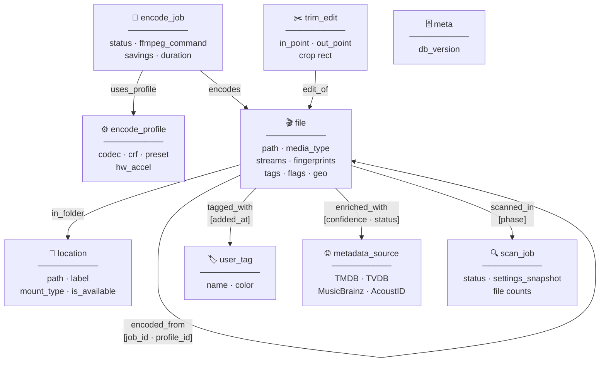

# MediaOrganizer — Database Structure

SurrealDB 3.0, `kv-rocksdb` backend.
Namespace `vdf`, database `scanner`.

All RELATE tables are **typed edges** — they carry their own fields, are queryable directly,
and are first-class graph citizens. There are no junction tables, no foreign keys, no flat SQL.

---

## Graph Overview



---

## Node Tables

---

### `file`

The universal media file node. Handles video, audio, and image files uniformly.
Media-type-specific fields are `option<T>` — present only when applicable.

```surql
DEFINE TABLE IF NOT EXISTS file SCHEMALESS;

-- ── Identity ────────────────────────────────────────────────────────────────
DEFINE FIELD IF NOT EXISTS path                ON file TYPE string;   -- full absolute path, unique
DEFINE FIELD IF NOT EXISTS name                ON file TYPE string;   -- filename only
DEFINE FIELD IF NOT EXISTS extension           ON file TYPE string;   -- lowercase, no dot: "mp4"
DEFINE FIELD IF NOT EXISTS media_type          ON file TYPE string;   -- "video" | "audio" | "image" | "document" | "unknown"
DEFINE FIELD IF NOT EXISTS size_bytes          ON file TYPE int;
DEFINE FIELD IF NOT EXISTS sha256              ON file TYPE option<string>;
DEFINE FIELD IF NOT EXISTS created_at          ON file TYPE datetime; -- filesystem ctime UTC
DEFINE FIELD IF NOT EXISTS modified_at         ON file TYPE datetime; -- filesystem mtime UTC
DEFINE FIELD IF NOT EXISTS scanned_at          ON file TYPE datetime;

-- ── Duration / dimensions ────────────────────────────────────────────────────
DEFINE FIELD IF NOT EXISTS duration_secs       ON file TYPE option<float>;  -- video + audio
DEFINE FIELD IF NOT EXISTS width               ON file TYPE option<int>;    -- video + image
DEFINE FIELD IF NOT EXISTS height              ON file TYPE option<int>;    -- video + image

-- ── Container ────────────────────────────────────────────────────────────────
DEFINE FIELD IF NOT EXISTS container_format    ON file TYPE option<string>; -- "mp4" "mkv" "flac" …
DEFINE FIELD IF NOT EXISTS overall_bitrate_kbps ON file TYPE option<int>;

-- ── Streams (embedded array — one object per codec stream) ───────────────────
-- Each object: { index, codec_type, codec_name, codec_long_name,
--   width?, height?, fps?, tbr?, pixel_format?, color_space?, color_range?,
--   color_primaries?, color_transfer?, hdr_format?,            ← video
--   sample_rate_hz?, channels?, channel_layout?, bits_per_sample?, ← audio
--   bitrate_kbps?, language?, title?, default, forced }
DEFINE FIELD IF NOT EXISTS streams             ON file TYPE array<object>;

-- ── Container metadata tags ──────────────────────────────────────────────────
-- All ffprobe format.tags key-value pairs stored as one nested object.
-- Fields present vary by file; all access via tags.title, tags.artist, etc.
DEFINE FIELD IF NOT EXISTS tags                ON file TYPE option<object>;
-- Common: title, artist, album, album_artist, composer, genre, date, comment,
--         description, show, episode_id, season_number, track, disc,
--         copyright, encoder, lyrics, performer, grouping, bpm, key,
--         language, network, imdb_id, tmdb_id

-- ── Perceptual hash fingerprints ─────────────────────────────────────────────
-- phash_vector: one u64 per sample frame, stored as array<int> (SurrealDB has no u64)
-- Parallel with phash_timestamps. Used for pHash comparison + vector index.
DEFINE FIELD IF NOT EXISTS phash_vector        ON file TYPE array<int>;
DEFINE FIELD IF NOT EXISTS phash_timestamps    ON file TYPE array<float>;

-- iframe_phashes: one pHash per keyframe sample (I-frame timeline fingerprint)
DEFINE FIELD IF NOT EXISTS iframe_phashes      ON file TYPE array<int>;
DEFINE FIELD IF NOT EXISTS iframe_timestamps   ON file TYPE array<float>;

-- ── Audio fingerprint (Chromaprint) ──────────────────────────────────────────
-- One u32 per second of audio after majority-vote. Stored as array<int>.
DEFINE FIELD IF NOT EXISTS audio_fingerprint   ON file TYPE array<int>;

-- ── Temporal average hash ────────────────────────────────────────────────────
DEFINE FIELD IF NOT EXISTS temporal_avg_hash   ON file TYPE option<int>; -- single u64

-- ── MPEG-7 signature ─────────────────────────────────────────────────────────
DEFINE FIELD IF NOT EXISTS mpeg7_signature_path ON file TYPE option<string>; -- path to .sig file

-- ── Scene detection ──────────────────────────────────────────────────────────
DEFINE FIELD IF NOT EXISTS scene_change_timestamps ON file TYPE array<float>;
DEFINE FIELD IF NOT EXISTS effective_skip_start_secs ON file TYPE option<float>; -- computed from scdet + settings

-- ── Geospatial (images with GPS EXIF) ────────────────────────────────────────
DEFINE FIELD IF NOT EXISTS gps_location        ON file TYPE option<geometry<point>>;
DEFINE FIELD IF NOT EXISTS gps_altitude_m      ON file TYPE option<float>;
DEFINE FIELD IF NOT EXISTS gps_timestamp       ON file TYPE option<datetime>;

-- ── EXIF (image-specific camera metadata) ────────────────────────────────────
DEFINE FIELD IF NOT EXISTS exif_camera_make    ON file TYPE option<string>;
DEFINE FIELD IF NOT EXISTS exif_camera_model   ON file TYPE option<string>;
DEFINE FIELD IF NOT EXISTS exif_lens           ON file TYPE option<string>;
DEFINE FIELD IF NOT EXISTS exif_focal_length_mm ON file TYPE option<float>;
DEFINE FIELD IF NOT EXISTS exif_aperture       ON file TYPE option<float>;
DEFINE FIELD IF NOT EXISTS exif_shutter_speed  ON file TYPE option<string>;
DEFINE FIELD IF NOT EXISTS exif_iso            ON file TYPE option<int>;
DEFINE FIELD IF NOT EXISTS exif_flash          ON file TYPE option<bool>;
DEFINE FIELD IF NOT EXISTS exif_orientation    ON file TYPE option<int>; -- 1-8 EXIF rotation code
DEFINE FIELD IF NOT EXISTS exif_datetime       ON file TYPE option<datetime>;
DEFINE FIELD IF NOT EXISTS exif_software       ON file TYPE option<string>;
DEFINE FIELD IF NOT EXISTS exif_color_space    ON file TYPE option<string>;
DEFINE FIELD IF NOT EXISTS exif_white_balance  ON file TYPE option<string>;

-- ── Status flags (from C# EntryFlags enum) ───────────────────────────────────
DEFINE FIELD IF NOT EXISTS flag_manually_excluded    ON file TYPE bool DEFAULT false;
DEFINE FIELD IF NOT EXISTS flag_thumbnail_error      ON file TYPE bool DEFAULT false;
DEFINE FIELD IF NOT EXISTS flag_metadata_error       ON file TYPE bool DEFAULT false;
DEFINE FIELD IF NOT EXISTS flag_too_dark             ON file TYPE bool DEFAULT false;
DEFINE FIELD IF NOT EXISTS flag_no_audio_track       ON file TYPE bool DEFAULT false;
DEFINE FIELD IF NOT EXISTS flag_audio_fingerprint_error ON file TYPE bool DEFAULT false;
DEFINE FIELD IF NOT EXISTS flag_silent_audio_track   ON file TYPE bool DEFAULT false;
DEFINE FIELD IF NOT EXISTS is_missing                ON file TYPE bool DEFAULT false; -- path no longer exists
DEFINE FIELD IF NOT EXISTS scan_error                ON file TYPE option<string>;     -- last error message

-- ── External enrichment IDs ───────────────────────────────────────────────────
DEFINE FIELD IF NOT EXISTS tmdb_id             ON file TYPE option<int>;
DEFINE FIELD IF NOT EXISTS tvdb_id             ON file TYPE option<int>;
DEFINE FIELD IF NOT EXISTS imdb_id             ON file TYPE option<string>;
DEFINE FIELD IF NOT EXISTS musicbrainz_recording_id ON file TYPE option<string>;
DEFINE FIELD IF NOT EXISTS musicbrainz_release_id   ON file TYPE option<string>;
DEFINE FIELD IF NOT EXISTS acoustid            ON file TYPE option<string>;
DEFINE FIELD IF NOT EXISTS isrc                ON file TYPE option<string>;
DEFINE FIELD IF NOT EXISTS isan                ON file TYPE option<string>;
```

**Indexes on `file`:**
```surql
-- Unique path lookup (primary access pattern)
DEFINE INDEX IF NOT EXISTS file_path_unique   ON file FIELDS path UNIQUE;

-- Media type filter (list all video files, all images, etc.)
DEFINE INDEX IF NOT EXISTS file_media_type    ON file FIELDS media_type;

-- Extension filter
DEFINE INDEX IF NOT EXISTS file_extension     ON file FIELDS extension;

-- Size-based queries (find large files, storage analysis)
DEFINE INDEX IF NOT EXISTS file_size          ON file FIELDS size_bytes;

-- Duration queries (find files shorter/longer than N seconds)
DEFINE INDEX IF NOT EXISTS file_duration      ON file FIELDS duration_secs;

-- Missing file sweep
DEFINE INDEX IF NOT EXISTS file_is_missing    ON file FIELDS is_missing;

-- Error sweep (retry failed scans)
DEFINE INDEX IF NOT EXISTS file_metadata_error ON file FIELDS flag_metadata_error;

-- Full-text search across all metadata tags
DEFINE ANALYZER IF NOT EXISTS media_text TOKENIZERS blank,class FILTERS lowercase,ascii;
DEFINE INDEX IF NOT EXISTS file_name_fts      ON file FIELDS name
    SEARCH ANALYZER media_text BM25(1.2, 0.75);
DEFINE INDEX IF NOT EXISTS file_tags_fts      ON file FIELDS tags
    SEARCH ANALYZER media_text BM25(1.2, 0.75);

-- Vector index for pHash nearest-neighbour similarity search
-- MTREE with Hamming distance — correct for bitwise perceptual hashes
DEFINE INDEX IF NOT EXISTS file_phash_vec     ON file FIELDS phash_vector
    MTREE DIMENSION 64 DIST HAMMING;

-- Geospatial index for GPS clustering (images)
DEFINE INDEX IF NOT EXISTS file_gps           ON file FIELDS gps_location;

-- Compound: media type + duration (primary scan comparison pre-filter)
DEFINE INDEX IF NOT EXISTS file_type_duration ON file FIELDS media_type, duration_secs;

-- Modification date (library freshness, enrichment targeting)
DEFINE INDEX IF NOT EXISTS file_modified      ON file FIELDS modified_at;
```

---

### `location`

A directory or mount point that has been added as a scan root.

```surql
DEFINE TABLE IF NOT EXISTS location SCHEMALESS;

DEFINE FIELD IF NOT EXISTS path                ON location TYPE string;  -- absolute path, unique
DEFINE FIELD IF NOT EXISTS name                ON location TYPE string;  -- display name (last path component)
DEFINE FIELD IF NOT EXISTS label               ON location TYPE option<string>; -- user-defined friendly name: "NAS Movies"
DEFINE FIELD IF NOT EXISTS mount_type          ON location TYPE string;  -- "local"|"smb"|"nfs"|"usb"|"docker_volume"|"s3"
DEFINE FIELD IF NOT EXISTS is_excluded         ON location TYPE bool DEFAULT false;
DEFINE FIELD IF NOT EXISTS include_extensions  ON location TYPE option<array<string>>;  -- override global
DEFINE FIELD IF NOT EXISTS exclude_patterns    ON location TYPE option<array<string>>;  -- glob patterns
DEFINE FIELD IF NOT EXISTS include_subdirs     ON location TYPE bool DEFAULT true;
DEFINE FIELD IF NOT EXISTS ignore_reparse_points ON location TYPE bool DEFAULT false;
DEFINE FIELD IF NOT EXISTS last_scanned_at     ON location TYPE option<datetime>;
DEFINE FIELD IF NOT EXISTS file_count          ON location TYPE int DEFAULT 0;
DEFINE FIELD IF NOT EXISTS total_size_bytes    ON location TYPE int DEFAULT 0;
DEFINE FIELD IF NOT EXISTS is_available        ON location TYPE bool DEFAULT true; -- reachable right now
DEFINE FIELD IF NOT EXISTS added_at            ON location TYPE datetime;
```

**Indexes on `location`:**
```surql
DEFINE INDEX IF NOT EXISTS location_path_unique ON location FIELDS path UNIQUE;
DEFINE INDEX IF NOT EXISTS location_available   ON location FIELDS is_available;
```

---

### `encode_profile`

A named FFmpeg encoding preset. Used for re-encoding, compression, and format conversion.
Covers video, audio, and image targets.

```surql
DEFINE TABLE IF NOT EXISTS encode_profile SCHEMALESS;

DEFINE FIELD IF NOT EXISTS name               ON encode_profile TYPE string;   -- unique user-defined name
DEFINE FIELD IF NOT EXISTS description        ON encode_profile TYPE option<string>;
DEFINE FIELD IF NOT EXISTS media_type         ON encode_profile TYPE string;   -- "video"|"audio"|"image"
DEFINE FIELD IF NOT EXISTS output_extension   ON encode_profile TYPE string;   -- "mp4" "flac" "webp"

-- ── Video encode settings ─────────────────────────────────────────────────────
DEFINE FIELD IF NOT EXISTS video_codec        ON encode_profile TYPE option<string>;
    -- libx264 | libx265 | libsvtav1 | libvpx-vp9 | libav1 | copy | none
DEFINE FIELD IF NOT EXISTS video_preset       ON encode_profile TYPE option<string>;
    -- x264/x265: ultrafast|superfast|veryfast|faster|fast|medium|slow|slower|veryslow
    -- svtav1: 0–13 (lower = slower/better)
DEFINE FIELD IF NOT EXISTS crf                ON encode_profile TYPE option<int>;
    -- x264: 0-51 (18-28 typical), x265: 0-51 (24-28 typical), svtav1: 1-63
DEFINE FIELD IF NOT EXISTS video_bitrate_kbps ON encode_profile TYPE option<int>;  -- 0 = use CRF
DEFINE FIELD IF NOT EXISTS max_width          ON encode_profile TYPE option<int>;
DEFINE FIELD IF NOT EXISTS max_height         ON encode_profile TYPE option<int>;
DEFINE FIELD IF NOT EXISTS pixel_format       ON encode_profile TYPE option<string>; -- yuv420p yuv420p10le
DEFINE FIELD IF NOT EXISTS frame_rate         ON encode_profile TYPE option<float>;  -- null = preserve
DEFINE FIELD IF NOT EXISTS tune               ON encode_profile TYPE option<string>; -- film|animation|grain|zerolatency
DEFINE FIELD IF NOT EXISTS hw_accel           ON encode_profile TYPE option<string>; -- "vaapi"|"nvenc"|"videotoolbox"|"qsv"
DEFINE FIELD IF NOT EXISTS hw_device          ON encode_profile TYPE option<string>; -- "/dev/dri/renderD128"

-- ── Audio encode settings ──────────────────────────────────────────────────────
DEFINE FIELD IF NOT EXISTS audio_codec        ON encode_profile TYPE option<string>;
    -- aac | libmp3lame | flac | libopus | libvorbis | pcm_s16le | copy | none
DEFINE FIELD IF NOT EXISTS audio_bitrate_kbps ON encode_profile TYPE option<int>;
DEFINE FIELD IF NOT EXISTS audio_sample_rate_hz ON encode_profile TYPE option<int>;
DEFINE FIELD IF NOT EXISTS audio_channels     ON encode_profile TYPE option<int>;
DEFINE FIELD IF NOT EXISTS audio_normalization ON encode_profile TYPE option<string>; -- "none"|"ebu_r128"|"peak"
DEFINE FIELD IF NOT EXISTS audio_norm_target_lufs ON encode_profile TYPE option<float>; -- default -23.0

-- ── Image encode settings ──────────────────────────────────────────────────────
DEFINE FIELD IF NOT EXISTS image_format       ON encode_profile TYPE option<string>; -- jpeg|webp|avif|png|heic
DEFINE FIELD IF NOT EXISTS image_quality      ON encode_profile TYPE option<int>;    -- 1-100
DEFINE FIELD IF NOT EXISTS max_dimension      ON encode_profile TYPE option<int>;    -- longest edge in pixels
DEFINE FIELD IF NOT EXISTS strip_exif         ON encode_profile TYPE bool DEFAULT false;

-- ── Container / mux settings ──────────────────────────────────────────────────
DEFINE FIELD IF NOT EXISTS copy_metadata      ON encode_profile TYPE bool DEFAULT true;
DEFINE FIELD IF NOT EXISTS metadata_overrides ON encode_profile TYPE option<object>;
DEFINE FIELD IF NOT EXISTS faststart          ON encode_profile TYPE bool DEFAULT true;
    -- moves moov atom to start of file (required for progressive web playback)

-- ── Computed FFmpeg args ──────────────────────────────────────────────────────
-- Cached serialisation of the above settings into ffmpeg CLI args.
-- Regenerated whenever settings change.
DEFINE FIELD IF NOT EXISTS ffmpeg_args_cache  ON encode_profile TYPE option<array<string>>;

DEFINE FIELD IF NOT EXISTS created_at         ON encode_profile TYPE datetime;
DEFINE FIELD IF NOT EXISTS updated_at         ON encode_profile TYPE datetime;
DEFINE FIELD IF NOT EXISTS is_builtin         ON encode_profile TYPE bool DEFAULT false; -- shipped default preset
```

**Indexes on `encode_profile`:**
```surql
DEFINE INDEX IF NOT EXISTS profile_name_unique ON encode_profile FIELDS name UNIQUE;
DEFINE INDEX IF NOT EXISTS profile_media_type  ON encode_profile FIELDS media_type;
```

---

### `encode_job`

One encode execution. Created when a file is queued for re-encoding.
Complete audit trail: ffmpeg command, timing, file sizes, error messages.

```surql
DEFINE TABLE IF NOT EXISTS encode_job SCHEMALESS;

DEFINE FIELD IF NOT EXISTS status             ON encode_job TYPE string;
    -- "queued"|"running"|"complete"|"failed"|"cancelled"
DEFINE FIELD IF NOT EXISTS input_path         ON encode_job TYPE string;
DEFINE FIELD IF NOT EXISTS output_path        ON encode_job TYPE string;
DEFINE FIELD IF NOT EXISTS profile_id         ON encode_job TYPE record<encode_profile>;

DEFINE FIELD IF NOT EXISTS queued_at          ON encode_job TYPE datetime;
DEFINE FIELD IF NOT EXISTS started_at         ON encode_job TYPE option<datetime>;
DEFINE FIELD IF NOT EXISTS completed_at       ON encode_job TYPE option<datetime>;

DEFINE FIELD IF NOT EXISTS input_size_bytes   ON encode_job TYPE int;
DEFINE FIELD IF NOT EXISTS output_size_bytes  ON encode_job TYPE option<int>;
DEFINE FIELD IF NOT EXISTS savings_bytes      ON encode_job TYPE option<int>;
DEFINE FIELD IF NOT EXISTS savings_percent    ON encode_job TYPE option<float>;
DEFINE FIELD IF NOT EXISTS encode_duration_secs ON encode_job TYPE option<float>;

DEFINE FIELD IF NOT EXISTS ffmpeg_command     ON encode_job TYPE string; -- full reproducible CLI command
DEFINE FIELD IF NOT EXISTS ffmpeg_stderr_tail ON encode_job TYPE option<string>; -- last 2000 chars of stderr

DEFINE FIELD IF NOT EXISTS error_message      ON encode_job TYPE option<string>;
DEFINE FIELD IF NOT EXISTS retry_count        ON encode_job TYPE int DEFAULT 0;
DEFINE FIELD IF NOT EXISTS worker_id          ON encode_job TYPE option<string>;
```

**Indexes on `encode_job`:**
```surql
DEFINE INDEX IF NOT EXISTS job_status          ON encode_job FIELDS status;
DEFINE INDEX IF NOT EXISTS job_input_path      ON encode_job FIELDS input_path;
DEFINE INDEX IF NOT EXISTS job_queued_at       ON encode_job FIELDS queued_at;
```

---

### `scan_job`

One complete scan run. Settings captured at scan time for reproducibility and diff analysis.

```surql
DEFINE TABLE IF NOT EXISTS scan_job SCHEMALESS;

DEFINE FIELD IF NOT EXISTS status             ON scan_job TYPE string;
    -- "running"|"complete"|"failed"|"cancelled"
DEFINE FIELD IF NOT EXISTS started_at         ON scan_job TYPE datetime;
DEFINE FIELD IF NOT EXISTS completed_at       ON scan_job TYPE option<datetime>;

DEFINE FIELD IF NOT EXISTS include_dirs       ON scan_job TYPE array<string>;
DEFINE FIELD IF NOT EXISTS exclude_dirs       ON scan_job TYPE array<string>;
DEFINE FIELD IF NOT EXISTS settings_snapshot  ON scan_job TYPE object;
    -- full serialised Settings struct at time of scan; allows replaying or diffing scans

DEFINE FIELD IF NOT EXISTS files_discovered   ON scan_job TYPE int DEFAULT 0;
DEFINE FIELD IF NOT EXISTS files_hashed       ON scan_job TYPE int DEFAULT 0;
DEFINE FIELD IF NOT EXISTS files_skipped      ON scan_job TYPE int DEFAULT 0;
DEFINE FIELD IF NOT EXISTS files_errored      ON scan_job TYPE int DEFAULT 0;
DEFINE FIELD IF NOT EXISTS duplicates_found   ON scan_job TYPE int DEFAULT 0;
DEFINE FIELD IF NOT EXISTS error_message      ON scan_job TYPE option<string>;
```

**Indexes on `scan_job`:**
```surql
DEFINE INDEX IF NOT EXISTS scan_started       ON scan_job FIELDS started_at;
DEFINE INDEX IF NOT EXISTS scan_status        ON scan_job FIELDS status;
```

---

### `user_tag`

User-defined label. Applied to files via the `tagged_with` edge.

```surql
DEFINE TABLE IF NOT EXISTS user_tag SCHEMALESS;

DEFINE FIELD IF NOT EXISTS name               ON user_tag TYPE string;
DEFINE FIELD IF NOT EXISTS color              ON user_tag TYPE option<string>; -- "#ff6b6b"
DEFINE FIELD IF NOT EXISTS description        ON user_tag TYPE option<string>;
DEFINE FIELD IF NOT EXISTS created_at         ON user_tag TYPE datetime;
```

**Indexes:**
```surql
DEFINE INDEX IF NOT EXISTS tag_name_unique    ON user_tag FIELDS name UNIQUE;
```

---

### `metadata_source`

An external metadata record from TMDB, TVDB, MusicBrainz, or AcoustID.
Files link to these via the `enriched_with` edge.

```surql
DEFINE TABLE IF NOT EXISTS metadata_source SCHEMALESS;

DEFINE FIELD IF NOT EXISTS source_type        ON metadata_source TYPE string;
    -- "tmdb_movie"|"tmdb_tv_episode"|"tvdb_episode"|"mb_recording"|"mb_release"|"mb_artist"
DEFINE FIELD IF NOT EXISTS external_id        ON metadata_source TYPE string; -- source's own ID

-- ── Universal fields ──────────────────────────────────────────────────────────
DEFINE FIELD IF NOT EXISTS title              ON metadata_source TYPE option<string>;
DEFINE FIELD IF NOT EXISTS original_title     ON metadata_source TYPE option<string>;
DEFINE FIELD IF NOT EXISTS year               ON metadata_source TYPE option<int>;
DEFINE FIELD IF NOT EXISTS description        ON metadata_source TYPE option<string>;
DEFINE FIELD IF NOT EXISTS genres             ON metadata_source TYPE array<string>;
DEFINE FIELD IF NOT EXISTS language           ON metadata_source TYPE option<string>;
DEFINE FIELD IF NOT EXISTS country            ON metadata_source TYPE option<string>;
DEFINE FIELD IF NOT EXISTS poster_url         ON metadata_source TYPE option<string>;
DEFINE FIELD IF NOT EXISTS backdrop_url       ON metadata_source TYPE option<string>;
DEFINE FIELD IF NOT EXISTS rating             ON metadata_source TYPE option<float>;
DEFINE FIELD IF NOT EXISTS vote_count         ON metadata_source TYPE option<int>;

-- ── TV-specific fields ─────────────────────────────────────────────────────────
DEFINE FIELD IF NOT EXISTS show_name          ON metadata_source TYPE option<string>;
DEFINE FIELD IF NOT EXISTS season_number      ON metadata_source TYPE option<int>;
DEFINE FIELD IF NOT EXISTS episode_number     ON metadata_source TYPE option<int>;
DEFINE FIELD IF NOT EXISTS episode_air_date   ON metadata_source TYPE option<datetime>;
DEFINE FIELD IF NOT EXISTS network            ON metadata_source TYPE option<string>;

-- ── Music-specific fields ──────────────────────────────────────────────────────
DEFINE FIELD IF NOT EXISTS artist_name        ON metadata_source TYPE option<string>;
DEFINE FIELD IF NOT EXISTS album_title        ON metadata_source TYPE option<string>;
DEFINE FIELD IF NOT EXISTS track_number       ON metadata_source TYPE option<int>;
DEFINE FIELD IF NOT EXISTS disc_number        ON metadata_source TYPE option<int>;
DEFINE FIELD IF NOT EXISTS label              ON metadata_source TYPE option<string>;
DEFINE FIELD IF NOT EXISTS isrc               ON metadata_source TYPE option<string>;
DEFINE FIELD IF NOT EXISTS acoustid           ON metadata_source TYPE option<string>;
DEFINE FIELD IF NOT EXISTS bpm                ON metadata_source TYPE option<float>;
DEFINE FIELD IF NOT EXISTS key                ON metadata_source TYPE option<string>; -- "C#m" "Eb"

DEFINE FIELD IF NOT EXISTS fetched_at         ON metadata_source TYPE datetime;
DEFINE FIELD IF NOT EXISTS raw_response       ON metadata_source TYPE option<object>; -- original API JSON
```

**Indexes:**
```surql
DEFINE INDEX IF NOT EXISTS meta_source_external ON metadata_source FIELDS source_type, external_id UNIQUE;
DEFINE INDEX IF NOT EXISTS meta_source_type     ON metadata_source FIELDS source_type;
```

---

### `trim_edit`

Non-destructive edit instruction. Stored in DB, applied on export via `ffmpeg -c copy`.

```surql
DEFINE TABLE IF NOT EXISTS trim_edit SCHEMALESS;

DEFINE FIELD IF NOT EXISTS edit_type          ON trim_edit TYPE string; -- "trim"|"chapter_split"|"crop"
DEFINE FIELD IF NOT EXISTS in_point_secs      ON trim_edit TYPE option<float>;
DEFINE FIELD IF NOT EXISTS out_point_secs     ON trim_edit TYPE option<float>;
DEFINE FIELD IF NOT EXISTS crop_x             ON trim_edit TYPE option<int>;
DEFINE FIELD IF NOT EXISTS crop_y             ON trim_edit TYPE option<int>;
DEFINE FIELD IF NOT EXISTS crop_width         ON trim_edit TYPE option<int>;
DEFINE FIELD IF NOT EXISTS crop_height        ON trim_edit TYPE option<int>;
DEFINE FIELD IF NOT EXISTS chapter_index      ON trim_edit TYPE option<int>; -- for chapter_split
DEFINE FIELD IF NOT EXISTS output_path        ON trim_edit TYPE option<string>;
DEFINE FIELD IF NOT EXISTS applied            ON trim_edit TYPE bool DEFAULT false;
DEFINE FIELD IF NOT EXISTS created_at         ON trim_edit TYPE datetime;
DEFINE FIELD IF NOT EXISTS applied_at         ON trim_edit TYPE option<datetime>;
```

---

### `meta`

Singleton table. One record with key `meta:db` stores schema version for migration.

```surql
DEFINE TABLE IF NOT EXISTS meta SCHEMALESS;
DEFINE FIELD IF NOT EXISTS db_version         ON meta TYPE int;
DEFINE FIELD IF NOT EXISTS created_at         ON meta TYPE datetime;
DEFINE FIELD IF NOT EXISTS last_migrated_at   ON meta TYPE option<datetime>;
```

---

## Relation (Edge) Tables

---

### `in_folder`  `file → location`

File lives under this location node.

```surql
DEFINE TABLE IF NOT EXISTS in_folder TYPE RELATION IN file OUT location SCHEMALESS;
-- No additional fields. The relation itself is the fact.
```

---

### `duplicate_of`  `file → file`

The core duplicate evidence edge. Every field captures *why* two files match,
not just that they do. Multiple methods can produce edges between the same pair;
each method gets its own edge (allowing cumulative evidence queries).

```surql
DEFINE TABLE IF NOT EXISTS duplicate_of TYPE RELATION IN file OUT file SCHEMALESS;

-- ── Match identity ─────────────────────────────────────────────────────────────
DEFINE FIELD IF NOT EXISTS similarity           ON duplicate_of TYPE float;
    -- 0.0–1.0; pHash Hamming similarity OR audio match score
DEFINE FIELD IF NOT EXISTS method               ON duplicate_of TYPE string;
    -- "frame_similarity"|"iframe_timeline"|"audio_fingerprint"
    -- |"mpeg7"|"temporal_avg"|"flipped"
    -- mirrors C# DuplicateFlags enum

-- ── Frame similarity evidence ──────────────────────────────────────────────────
DEFINE FIELD IF NOT EXISTS phash_scores         ON duplicate_of TYPE option<array<float>>;
    -- per-sample pHash similarity scores (one per thumbnail frame)

-- ── I-frame timeline evidence ─────────────────────────────────────────────────
DEFINE FIELD IF NOT EXISTS clip_offset_secs     ON duplicate_of TYPE option<float>;
    -- where in the *source* the matching clip starts
DEFINE FIELD IF NOT EXISTS consecutive_frames   ON duplicate_of TYPE option<int>;
    -- length of best consecutive matching run
DEFINE FIELD IF NOT EXISTS best_offset_idx      ON duplicate_of TYPE option<int>;
    -- index in the longer array where best alignment starts
DEFINE FIELD IF NOT EXISTS iframe_match_percent ON duplicate_of TYPE option<float>;
    -- fraction of the shorter video's frames that matched

-- ── Audio fingerprint evidence ──────────────────────────────────────────────────
DEFINE FIELD IF NOT EXISTS audio_offset_secs    ON duplicate_of TYPE option<float>;
    -- time in source where the clip's audio starts

-- ── SSIM verification (second-pass confirm/reject) ────────────────────────────
DEFINE FIELD IF NOT EXISTS ssim_score           ON duplicate_of TYPE option<float>;
    -- null = not run; <reject_threshold = hard-rejected (edge should be deleted)

-- ── Flags ──────────────────────────────────────────────────────────────────────
DEFINE FIELD IF NOT EXISTS is_flipped           ON duplicate_of TYPE bool DEFAULT false;
    -- horizontally mirrored match

-- ── Audit ──────────────────────────────────────────────────────────────────────
DEFINE FIELD IF NOT EXISTS discovered_at        ON duplicate_of TYPE datetime;
DEFINE FIELD IF NOT EXISTS discovered_in        ON duplicate_of TYPE option<record<scan_job>>;
DEFINE FIELD IF NOT EXISTS confirmed_by_user    ON duplicate_of TYPE bool DEFAULT false;
DEFINE FIELD IF NOT EXISTS dismissed_by_user    ON duplicate_of TYPE bool DEFAULT false;
```

**Indexes on `duplicate_of`:**
```surql
DEFINE INDEX IF NOT EXISTS dup_similarity      ON duplicate_of FIELDS similarity;
DEFINE INDEX IF NOT EXISTS dup_method          ON duplicate_of FIELDS method;
DEFINE INDEX IF NOT EXISTS dup_dismissed       ON duplicate_of FIELDS dismissed_by_user;
-- Compound: find all non-dismissed high-similarity pairs (primary results query)
DEFINE INDEX IF NOT EXISTS dup_active_sim      ON duplicate_of FIELDS dismissed_by_user, similarity;
```

---

### `blacklisted`  `file → file`

Pair permanently excluded from duplicate results. Never shown again unless removed.

```surql
DEFINE TABLE IF NOT EXISTS blacklisted TYPE RELATION IN file OUT file SCHEMALESS;

DEFINE FIELD IF NOT EXISTS added_at            ON blacklisted TYPE datetime;
DEFINE FIELD IF NOT EXISTS reason              ON blacklisted TYPE option<string>;
```

**Index:**
```surql
-- Fast lookup: is this pair blacklisted? (called before every comparison)
DEFINE INDEX IF NOT EXISTS blacklist_pair      ON blacklisted FIELDS in, out;
```

---

### `encoded_from`  `file → file`

Output file was encoded from input file. Tracks the complete provenance chain.
`in` = output file (the new encode), `out` = source file (the original).

```surql
DEFINE TABLE IF NOT EXISTS encoded_from TYPE RELATION IN file OUT file SCHEMALESS;

DEFINE FIELD IF NOT EXISTS job_id              ON encoded_from TYPE record<encode_job>;
DEFINE FIELD IF NOT EXISTS profile_id          ON encoded_from TYPE record<encode_profile>;
DEFINE FIELD IF NOT EXISTS encoded_at          ON encoded_from TYPE datetime;
```

---

### `tagged_with`  `file → user_tag`

```surql
DEFINE TABLE IF NOT EXISTS tagged_with TYPE RELATION IN file OUT user_tag SCHEMALESS;

DEFINE FIELD IF NOT EXISTS added_at            ON tagged_with TYPE datetime;
```

---

### `enriched_with`  `file → metadata_source`

Links a file to a matched external metadata record. Status tracks the review workflow.

```surql
DEFINE TABLE IF NOT EXISTS enriched_with TYPE RELATION IN file OUT metadata_source SCHEMALESS;

DEFINE FIELD IF NOT EXISTS confidence          ON enriched_with TYPE float;  -- 0.0–1.0
DEFINE FIELD IF NOT EXISTS status             ON enriched_with TYPE string;
    -- "pending"|"approved"|"rejected"|"auto_applied"
DEFINE FIELD IF NOT EXISTS reviewed_at         ON enriched_with TYPE option<datetime>;
DEFINE FIELD IF NOT EXISTS applied_fields      ON enriched_with TYPE option<array<string>>;
    -- which tag fields were actually written on approval
```

**Index:**
```surql
DEFINE INDEX IF NOT EXISTS enriched_status     ON enriched_with FIELDS status;
```

---

### `scanned_in`  `file → scan_job`

Tracks which scan job discovered or last updated each file.

```surql
DEFINE TABLE IF NOT EXISTS scanned_in TYPE RELATION IN file OUT scan_job SCHEMALESS;

DEFINE FIELD IF NOT EXISTS phase               ON scanned_in TYPE string;
    -- "discovered"|"hashed"|"compared"
DEFINE FIELD IF NOT EXISTS scanned_at          ON scanned_in TYPE datetime;
```

---

### `edit_of`  `trim_edit → file`

Links a trim/crop edit instruction to its source file.

```surql
DEFINE TABLE IF NOT EXISTS edit_of TYPE RELATION IN trim_edit OUT file SCHEMALESS;
-- No additional fields.
```

---

### `uses_profile`  `encode_job → encode_profile`

```surql
DEFINE TABLE IF NOT EXISTS uses_profile TYPE RELATION IN encode_job OUT encode_profile SCHEMALESS;
-- No additional fields.
```

---

### `encodes`  `encode_job → file`

```surql
DEFINE TABLE IF NOT EXISTS encodes TYPE RELATION IN encode_job OUT file SCHEMALESS;
-- No additional fields.
```

---

## SurrealDB-Specific Features in Use

### Live queries — real-time scan progress

The UI subscribes to scan and encode job changes without polling:

```surql
-- Client subscribes once; any status/count change on the current scan_job fires the callback
LIVE SELECT status, files_hashed, files_discovered, duplicates_found
FROM scan_job WHERE status = "running";

-- Live duplicate feed — new edges appear in UI as scan runs
LIVE SELECT in.path, out.path, similarity, method
FROM duplicate_of WHERE discovered_in = $current_scan_id;
```

### Vector search — pHash nearest-neighbour

Find all files whose pHash is within Hamming distance 10 of a given hash array:

```surql
SELECT path, media_type, duration_secs,
       vector::distance::hamming(phash_vector, $query_vector) AS distance
FROM file
WHERE vector::distance::hamming(phash_vector, $query_vector) < 10
ORDER BY distance ASC
LIMIT 50;
```

### Geospatial — GPS image clustering

Find all images taken within 500 metres of a GPS point:

```surql
SELECT path, gps_location, exif_datetime, tags.title
FROM file
WHERE media_type = "image"
  AND geo::distance(gps_location, $centre_point) < 500
ORDER BY exif_datetime ASC;
```

Find images within a bounding box (e.g., a city block):

```surql
SELECT path, gps_location FROM file
WHERE media_type = "image"
  AND geo::intersects(gps_location, $bounding_box);
```

### Full-text search — metadata search across entire library

```surql
SELECT path, tags.title, tags.artist, tags.album, search::score(1) AS relevance
FROM file
WHERE name @1@ $query OR tags @2@ $query
ORDER BY relevance DESC
LIMIT 20;
```

### Events — trigger on new duplicate edge

Automatically increment the `duplicates_found` counter on the parent scan_job
whenever a new `duplicate_of` edge is created:

```surql
DEFINE EVENT IF NOT EXISTS on_duplicate_created ON TABLE duplicate_of
    WHEN $event = "CREATE"
    THEN {
        UPDATE scan_job SET duplicates_found += 1
        WHERE id = $value.discovered_in;
    };
```

### User-defined functions — common graph traversals

```surql
-- Returns all duplicate clusters as transitive groups
DEFINE FUNCTION IF NOT EXISTS fn::duplicate_clusters($min_similarity: float) {
    RETURN SELECT VALUE array::group(
        SELECT VALUE [in.id, out.id]
        FROM duplicate_of
        WHERE similarity >= $min_similarity
          AND dismissed_by_user = false
    );
};

-- Returns the "best" file in a cluster (highest bitrate × resolution product)
DEFINE FUNCTION IF NOT EXISTS fn::best_in_cluster($file_ids: array) {
    RETURN (
        SELECT id, path,
               (math::max(streams[WHERE codec_type = "video"].bitrate_kbps) ?? 0)
               * (math::max(streams[WHERE codec_type = "video"].width) ?? 0) AS quality_score
        FROM file
        WHERE id IN $file_ids
        ORDER BY quality_score DESC
        LIMIT 1
    )[0];
};
```

---

## Key Query Patterns

```surql
-- All duplicates of a file (graph walk, no JOIN)
SELECT ->duplicate_of->(file.*) FROM file:abc123;

-- All files in a folder (reverse traverse)
SELECT <-in_folder<-file.* FROM location:xyz789;

-- Duplicate clusters (transitive: A≈B≈C via graph depth)
SELECT in.path, out.path, similarity, method
FROM duplicate_of
WHERE dismissed_by_user = false
ORDER BY similarity DESC;

-- Highest-similarity pairs across the whole library
SELECT in.path, out.path, similarity, method, clip_offset_secs
FROM duplicate_of
WHERE dismissed_by_user = false
ORDER BY similarity DESC LIMIT 50;

-- Files that are sources (have clips taken from them)
SELECT path, count(->duplicate_of) AS times_clipped
FROM file
WHERE ->duplicate_of.method CONTAINS "iframe_timeline"
ORDER BY times_clipped DESC LIMIT 20;

-- Per-folder duplicate stats
SELECT out.path AS folder, count(<-in_folder<-file) AS total_files,
       count(<-in_folder<-file->duplicate_of) AS duplicated_files
FROM in_folder GROUP BY out;

-- Encode savings summary
SELECT sum(savings_bytes) AS total_saved,
       count() AS jobs_complete,
       math::mean(savings_percent) AS avg_savings_pct
FROM encode_job WHERE status = "complete";

-- All files not yet enriched (no approved enriched_with edge)
SELECT path, media_type, tags.title FROM file
WHERE ->enriched_with[WHERE status = "approved"] IS NONE;

-- Find files from the same GPS cluster (within 1km)
SELECT path, gps_location, exif_datetime FROM file
WHERE media_type = "image"
  AND geo::distance(gps_location, (SELECT gps_location FROM file WHERE id = $target)) < 1000;

-- Codec distribution across library
SELECT streams[WHERE codec_type = "video"].codec_name AS codec, count() AS file_count
FROM file WHERE media_type = "video"
GROUP BY codec ORDER BY file_count DESC;

-- Storage savings opportunity: re-encode candidates > 10 MB, no recent encode job
SELECT path, size_bytes, streams[WHERE codec_type = "video"][0].codec_name AS codec
FROM file
WHERE media_type = "video"
  AND size_bytes > 10485760
  AND <-encodes IS NONE
ORDER BY size_bytes DESC LIMIT 100;
```

---

## Migration Strategy

```surql
-- On startup: read version, run pending migrations, update version
SELECT db_version FROM meta:db;

-- Example migration from v1 → v2 (adding gps_location field + index)
IF (SELECT db_version FROM meta:db)[0].db_version < 2 THEN {
    DEFINE FIELD IF NOT EXISTS gps_location ON file TYPE option<geometry<point>>;
    DEFINE INDEX IF NOT EXISTS file_gps ON file FIELDS gps_location;
    UPDATE meta:db SET db_version = 2, last_migrated_at = time::now();
};
```

---

## Namespace / Database

```surql
USE NS vdf DB scanner;
```

Always open with:
```rust
db.use_ns("vdf").use_db("scanner").await?;
```

Current schema version: **1**
