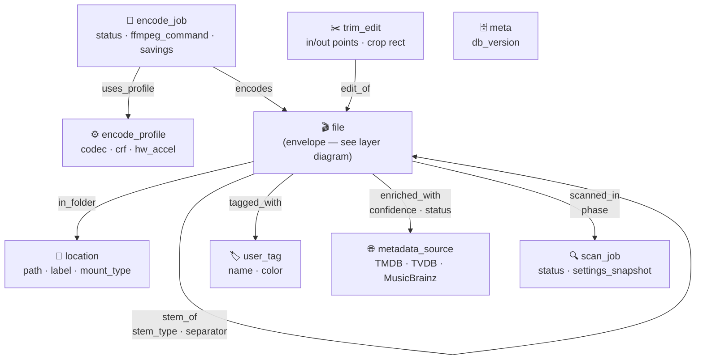
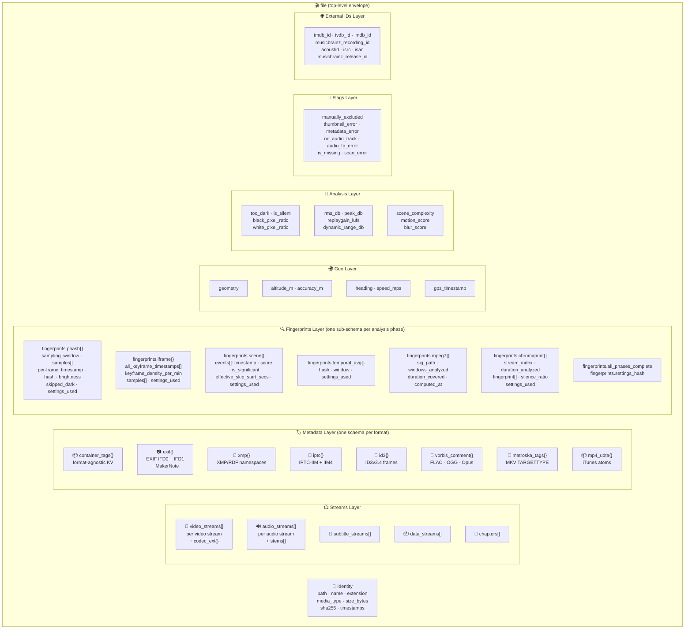

# MediaOrganizer — Database Structure

SurrealDB 3.0, `kv-rocksdb` backend.
Namespace `vdf`, database `scanner`.

---

## Graph: Table Connections



---

## File Node: Layer Diagram

The `file` node is a **thin envelope**. Every domain of information lives in its own
nested sub-schema. The top level identifies the file; the layers hold the detail.



---

## Node Tables

---

### `file`

Top-level envelope. Thin identity fields only. All rich data lives in nested sub-schemas.

```surql
DEFINE TABLE IF NOT EXISTS file SCHEMALESS;

-- ═══════════════════════════════════════════════════════════════════════════════
-- TOP LEVEL — IDENTITY ONLY
-- ═══════════════════════════════════════════════════════════════════════════════
DEFINE FIELD IF NOT EXISTS path         ON file TYPE string;
DEFINE FIELD IF NOT EXISTS name         ON file TYPE string;
DEFINE FIELD IF NOT EXISTS extension    ON file TYPE string;   -- lowercase, no dot
DEFINE FIELD IF NOT EXISTS media_type   ON file TYPE string;   -- "video"|"audio"|"image"|"document"|"unknown"
DEFINE FIELD IF NOT EXISTS size_bytes   ON file TYPE int;
DEFINE FIELD IF NOT EXISTS sha256       ON file TYPE option<string>;
DEFINE FIELD IF NOT EXISTS created_at   ON file TYPE datetime;
DEFINE FIELD IF NOT EXISTS modified_at  ON file TYPE datetime;
DEFINE FIELD IF NOT EXISTS scanned_at   ON file TYPE datetime;
```

---

#### Sub-schema: `container`

Top-level container/format facts that apply to the whole file, not to any single stream.

```surql
DEFINE FIELD IF NOT EXISTS container                        ON file TYPE option<object>;
DEFINE FIELD IF NOT EXISTS container.format                 ON file TYPE option<string>;
    -- "mp4"|"matroska"|"avi"|"mov"|"ogg"|"flac"|"wav"|"aiff"|"jpeg"|"png"|"webp"|…
DEFINE FIELD IF NOT EXISTS container.format_long            ON file TYPE option<string>;
DEFINE FIELD IF NOT EXISTS container.duration_secs          ON file TYPE option<float>;
DEFINE FIELD IF NOT EXISTS container.start_time_secs        ON file TYPE option<float>;
DEFINE FIELD IF NOT EXISTS container.overall_bitrate_kbps   ON file TYPE option<int>;
DEFINE FIELD IF NOT EXISTS container.nb_streams             ON file TYPE option<int>;
DEFINE FIELD IF NOT EXISTS container.nb_programs            ON file TYPE option<int>;
DEFINE FIELD IF NOT EXISTS container.probe_score            ON file TYPE option<int>;  -- ffprobe confidence 0-100

-- Chapters (embedded array — not a separate table; chapters belong to the file)
-- Each element: { index, title, start_time_secs, end_time_secs }
DEFINE FIELD IF NOT EXISTS container.chapters               ON file TYPE array<object>;
DEFINE FIELD IF NOT EXISTS container.chapters[*].index      ON file TYPE int;
DEFINE FIELD IF NOT EXISTS container.chapters[*].title      ON file TYPE option<string>;
DEFINE FIELD IF NOT EXISTS container.chapters[*].start_secs ON file TYPE float;
DEFINE FIELD IF NOT EXISTS container.chapters[*].end_secs   ON file TYPE float;

-- Convenience denorm — width/height/duration promoted for index/query speed
-- (sourced from the first video/audio stream during scan; avoids array traversal in WHERE)
DEFINE FIELD IF NOT EXISTS container.width                  ON file TYPE option<int>;
DEFINE FIELD IF NOT EXISTS container.height                 ON file TYPE option<int>;
```

---

#### Sub-schema: `video_streams`

Array of video stream objects. Each stream carries its own codec-specific extension block
(`codec_ext`) so future codecs (AV2, VVC) can add fields without polluting the base schema.

```surql
DEFINE FIELD IF NOT EXISTS video_streams                         ON file TYPE array<object>;

-- ── Base fields (all video streams) ───────────────────────────────────────────
DEFINE FIELD IF NOT EXISTS video_streams[*].index                ON file TYPE int;
DEFINE FIELD IF NOT EXISTS video_streams[*].codec_name           ON file TYPE string;   -- "h264"|"hevc"|"av1"|"vp9"|"av2"…
DEFINE FIELD IF NOT EXISTS video_streams[*].codec_long_name      ON file TYPE option<string>;
DEFINE FIELD IF NOT EXISTS video_streams[*].codec_tag            ON file TYPE option<string>;   -- FourCC: "avc1" "hev1"
DEFINE FIELD IF NOT EXISTS video_streams[*].codec_profile        ON file TYPE option<string>;   -- "High"|"Main 10"|"Main"|"Professional"
DEFINE FIELD IF NOT EXISTS video_streams[*].codec_level          ON file TYPE option<string>;   -- "4.1"|"5.1"
DEFINE FIELD IF NOT EXISTS video_streams[*].width                ON file TYPE option<int>;
DEFINE FIELD IF NOT EXISTS video_streams[*].height               ON file TYPE option<int>;
DEFINE FIELD IF NOT EXISTS video_streams[*].coded_width          ON file TYPE option<int>;      -- before crop/sar correction
DEFINE FIELD IF NOT EXISTS video_streams[*].coded_height         ON file TYPE option<int>;
DEFINE FIELD IF NOT EXISTS video_streams[*].display_aspect_ratio ON file TYPE option<string>;   -- "16:9"
DEFINE FIELD IF NOT EXISTS video_streams[*].sample_aspect_ratio  ON file TYPE option<string>;   -- "1:1"
DEFINE FIELD IF NOT EXISTS video_streams[*].fps                  ON file TYPE option<float>;    -- r_frame_rate reduced
DEFINE FIELD IF NOT EXISTS video_streams[*].avg_fps              ON file TYPE option<float>;    -- avg_frame_rate
DEFINE FIELD IF NOT EXISTS video_streams[*].tbr                  ON file TYPE option<float>;    -- time base rate
DEFINE FIELD IF NOT EXISTS video_streams[*].pixel_format         ON file TYPE option<string>;   -- "yuv420p"|"yuv420p10le"|"nv12"
DEFINE FIELD IF NOT EXISTS video_streams[*].bit_depth            ON file TYPE option<int>;      -- 8|10|12
DEFINE FIELD IF NOT EXISTS video_streams[*].bitrate_kbps         ON file TYPE option<int>;
DEFINE FIELD IF NOT EXISTS video_streams[*].nb_frames            ON file TYPE option<int>;
DEFINE FIELD IF NOT EXISTS video_streams[*].duration_secs        ON file TYPE option<float>;
DEFINE FIELD IF NOT EXISTS video_streams[*].language             ON file TYPE option<string>;
DEFINE FIELD IF NOT EXISTS video_streams[*].title                ON file TYPE option<string>;
DEFINE FIELD IF NOT EXISTS video_streams[*].is_default           ON file TYPE bool DEFAULT false;
DEFINE FIELD IF NOT EXISTS video_streams[*].is_forced            ON file TYPE bool DEFAULT false;
DEFINE FIELD IF NOT EXISTS video_streams[*].is_attached_pic      ON file TYPE bool DEFAULT false; -- cover art stream

-- ── Color metadata ────────────────────────────────────────────────────────────
DEFINE FIELD IF NOT EXISTS video_streams[*].color_space          ON file TYPE option<string>;   -- "bt709"|"bt2020nc"
DEFINE FIELD IF NOT EXISTS video_streams[*].color_range          ON file TYPE option<string>;   -- "limited"|"full"
DEFINE FIELD IF NOT EXISTS video_streams[*].color_primaries      ON file TYPE option<string>;   -- "bt709"|"bt2020"
DEFINE FIELD IF NOT EXISTS video_streams[*].color_transfer       ON file TYPE option<string>;   -- "bt709"|"smpte2084"|"arib-std-b67"

-- ── HDR sub-schema ────────────────────────────────────────────────────────────
-- Nested under each video stream; null if SDR
DEFINE FIELD IF NOT EXISTS video_streams[*].hdr                  ON file TYPE option<object>;
DEFINE FIELD IF NOT EXISTS video_streams[*].hdr.format           ON file TYPE option<string>;
    -- "hdr10"|"hdr10plus"|"dolby_vision"|"hlg"|"sl_hdr2"
DEFINE FIELD IF NOT EXISTS video_streams[*].hdr.dv_profile       ON file TYPE option<int>;      -- Dolby Vision profile 5/7/8
DEFINE FIELD IF NOT EXISTS video_streams[*].hdr.dv_level         ON file TYPE option<int>;
DEFINE FIELD IF NOT EXISTS video_streams[*].hdr.max_cll          ON file TYPE option<int>;      -- nits
DEFINE FIELD IF NOT EXISTS video_streams[*].hdr.max_fall         ON file TYPE option<int>;      -- nits
DEFINE FIELD IF NOT EXISTS video_streams[*].hdr.master_display   ON file TYPE option<string>;   -- raw MDCV string
DEFINE FIELD IF NOT EXISTS video_streams[*].hdr.white_point_x    ON file TYPE option<float>;
DEFINE FIELD IF NOT EXISTS video_streams[*].hdr.white_point_y    ON file TYPE option<float>;

-- ── Codec extension block ─────────────────────────────────────────────────────
-- Codec-specific fields that don't belong in the base schema.
-- Keyed by codec_name; only the relevant block is populated.
DEFINE FIELD IF NOT EXISTS video_streams[*].codec_ext            ON file TYPE option<object>;

-- H.264 / AVC
DEFINE FIELD IF NOT EXISTS video_streams[*].codec_ext.h264_ref_frames   ON file TYPE option<int>;
DEFINE FIELD IF NOT EXISTS video_streams[*].codec_ext.h264_cabac        ON file TYPE option<bool>;
DEFINE FIELD IF NOT EXISTS video_streams[*].codec_ext.h264_deblock      ON file TYPE option<bool>;

-- H.265 / HEVC
DEFINE FIELD IF NOT EXISTS video_streams[*].codec_ext.hevc_tier         ON file TYPE option<string>; -- "Main"|"High"
DEFINE FIELD IF NOT EXISTS video_streams[*].codec_ext.hevc_range_ext    ON file TYPE option<bool>;
DEFINE FIELD IF NOT EXISTS video_streams[*].codec_ext.hevc_scc          ON file TYPE option<bool>;   -- Screen Content Coding

-- AV1
DEFINE FIELD IF NOT EXISTS video_streams[*].codec_ext.av1_seq_profile   ON file TYPE option<int>;    -- 0 Main, 1 High, 2 Pro
DEFINE FIELD IF NOT EXISTS video_streams[*].codec_ext.av1_still_picture ON file TYPE option<bool>;
DEFINE FIELD IF NOT EXISTS video_streams[*].codec_ext.av1_film_grain    ON file TYPE option<bool>;
DEFINE FIELD IF NOT EXISTS video_streams[*].codec_ext.av1_grain_seed    ON file TYPE option<int>;

-- AV2 (future — AOM's next-generation codec after AV1)
-- Fields here are speculative/preparatory based on published AOM research directions
DEFINE FIELD IF NOT EXISTS video_streams[*].codec_ext.av2_partition_type        ON file TYPE option<string>;
DEFINE FIELD IF NOT EXISTS video_streams[*].codec_ext.av2_neural_filter_type    ON file TYPE option<string>;
    -- "none"|"CDEF_ML"|"loop_restoration_ML" — learned in-loop filters
DEFINE FIELD IF NOT EXISTS video_streams[*].codec_ext.av2_grain_synthesis_model ON file TYPE option<string>;
    -- "parametric"|"film_grain_v2" — AV2 extends AV1's film grain synthesis
DEFINE FIELD IF NOT EXISTS video_streams[*].codec_ext.av2_superres_denom        ON file TYPE option<int>;
DEFINE FIELD IF NOT EXISTS video_streams[*].codec_ext.av2_render_size_width     ON file TYPE option<int>;
DEFINE FIELD IF NOT EXISTS video_streams[*].codec_ext.av2_render_size_height    ON file TYPE option<int>;
DEFINE FIELD IF NOT EXISTS video_streams[*].codec_ext.av2_sequence_header       ON file TYPE option<string>; -- base64 OBU

-- VVC / H.266
DEFINE FIELD IF NOT EXISTS video_streams[*].codec_ext.vvc_profile               ON file TYPE option<string>;
DEFINE FIELD IF NOT EXISTS video_streams[*].codec_ext.vvc_tier                  ON file TYPE option<string>;
DEFINE FIELD IF NOT EXISTS video_streams[*].codec_ext.vvc_ptl_frame_only        ON file TYPE option<bool>;
DEFINE FIELD IF NOT EXISTS video_streams[*].codec_ext.vvc_multilayer            ON file TYPE option<bool>;
```

---

#### Sub-schema: `audio_streams`

Array of audio stream objects. Each stream can carry a `stems` sub-array for separated
stem tracks (AI-separated or DAW stems). Stems that are separate files reference back
to their file record; stems embedded in the same container reference their stream index.

```surql
DEFINE FIELD IF NOT EXISTS audio_streams                              ON file TYPE array<object>;

-- ── Base fields ────────────────────────────────────────────────────────────────
DEFINE FIELD IF NOT EXISTS audio_streams[*].index                     ON file TYPE int;
DEFINE FIELD IF NOT EXISTS audio_streams[*].codec_name                ON file TYPE string;
    -- "aac"|"mp3"|"flac"|"opus"|"vorbis"|"pcm_s16le"|"pcm_s24le"|"pcm_f32le"|"alac"|"dts"|"ac3"|"eac3"|"truehd"
DEFINE FIELD IF NOT EXISTS audio_streams[*].codec_long_name           ON file TYPE option<string>;
DEFINE FIELD IF NOT EXISTS audio_streams[*].codec_tag                 ON file TYPE option<string>;
DEFINE FIELD IF NOT EXISTS audio_streams[*].codec_profile             ON file TYPE option<string>;   -- "LC"|"HE-AAC"|"HE-AACv2"
DEFINE FIELD IF NOT EXISTS audio_streams[*].sample_rate_hz            ON file TYPE option<int>;
DEFINE FIELD IF NOT EXISTS audio_streams[*].channels                  ON file TYPE option<int>;
DEFINE FIELD IF NOT EXISTS audio_streams[*].channel_layout            ON file TYPE option<string>;   -- "stereo"|"5.1"|"7.1"|"ambisonic"
DEFINE FIELD IF NOT EXISTS audio_streams[*].bits_per_sample           ON file TYPE option<int>;
DEFINE FIELD IF NOT EXISTS audio_streams[*].bits_per_raw_sample       ON file TYPE option<int>;
DEFINE FIELD IF NOT EXISTS audio_streams[*].bitrate_kbps              ON file TYPE option<int>;
DEFINE FIELD IF NOT EXISTS audio_streams[*].nb_frames                 ON file TYPE option<int>;
DEFINE FIELD IF NOT EXISTS audio_streams[*].duration_secs             ON file TYPE option<float>;
DEFINE FIELD IF NOT EXISTS audio_streams[*].language                  ON file TYPE option<string>;
DEFINE FIELD IF NOT EXISTS audio_streams[*].title                     ON file TYPE option<string>;
DEFINE FIELD IF NOT EXISTS audio_streams[*].is_default                ON file TYPE bool DEFAULT false;
DEFINE FIELD IF NOT EXISTS audio_streams[*].is_forced                 ON file TYPE bool DEFAULT false;

-- ── Format-specific extension block ──────────────────────────────────────────
DEFINE FIELD IF NOT EXISTS audio_streams[*].codec_ext                 ON file TYPE option<object>;

-- FLAC
DEFINE FIELD IF NOT EXISTS audio_streams[*].codec_ext.flac_min_blocksize    ON file TYPE option<int>;
DEFINE FIELD IF NOT EXISTS audio_streams[*].codec_ext.flac_max_blocksize    ON file TYPE option<int>;
DEFINE FIELD IF NOT EXISTS audio_streams[*].codec_ext.flac_min_framesize    ON file TYPE option<int>;
DEFINE FIELD IF NOT EXISTS audio_streams[*].codec_ext.flac_max_framesize    ON file TYPE option<int>;
DEFINE FIELD IF NOT EXISTS audio_streams[*].codec_ext.flac_md5              ON file TYPE option<string>;

-- DTS
DEFINE FIELD IF NOT EXISTS audio_streams[*].codec_ext.dts_profile          ON file TYPE option<string>;
    -- "DTS"|"DTS-ES"|"DTS-HD MA"|"DTS-HD HRA"|"DTS:X"
DEFINE FIELD IF NOT EXISTS audio_streams[*].codec_ext.dts_x_imax           ON file TYPE option<bool>;

-- Dolby
DEFINE FIELD IF NOT EXISTS audio_streams[*].codec_ext.dolby_atmos          ON file TYPE option<bool>;
DEFINE FIELD IF NOT EXISTS audio_streams[*].codec_ext.dolby_truehd_substream_count ON file TYPE option<int>;

-- Opus
DEFINE FIELD IF NOT EXISTS audio_streams[*].codec_ext.opus_version         ON file TYPE option<int>;
DEFINE FIELD IF NOT EXISTS audio_streams[*].codec_ext.opus_pre_skip        ON file TYPE option<int>;
DEFINE FIELD IF NOT EXISTS audio_streams[*].codec_ext.opus_output_gain     ON file TYPE option<float>;

-- ── Stems sub-schema ─────────────────────────────────────────────────────────
-- A stem is a separated component of this audio stream.
-- Can be: AI-separated (Demucs, Spleeter), DAW export stem, or embedded
-- sub-stream (e.g. Native Instruments .stem.mp4 format).
--
-- When the stem is a separate file in the library, stem.file_id points to
-- its file record. When it is embedded in this container, stem.stream_index
-- points to which audio_stream index within this same file contains it.
DEFINE FIELD IF NOT EXISTS audio_streams[*].stems                     ON file TYPE array<object>;

DEFINE FIELD IF NOT EXISTS audio_streams[*].stems[*].stem_type        ON file TYPE string;
    -- "vocals"|"drums"|"bass"|"guitar"|"piano"|"keys"|"strings"|"brass"
    -- |"other"|"melody"|"harmony"|"percussion"|"fx"|"master_bus"
    -- |"custom" (DAW stems have arbitrary names)
DEFINE FIELD IF NOT EXISTS audio_streams[*].stems[*].stem_label       ON file TYPE option<string>;
    -- user-defined or DAW track name; e.g. "Kick+Snare Bus", "Lead Vox"
DEFINE FIELD IF NOT EXISTS audio_streams[*].stems[*].separator_tool   ON file TYPE option<string>;
    -- "demucs"|"spleeter"|"daw_export"|"native_stems"|"manual"|…
DEFINE FIELD IF NOT EXISTS audio_streams[*].stems[*].separator_model  ON file TYPE option<string>;
    -- model variant, e.g. "htdemucs_ft"|"4stems"|"2stems"
DEFINE FIELD IF NOT EXISTS audio_streams[*].stems[*].separation_date  ON file TYPE option<datetime>;
DEFINE FIELD IF NOT EXISTS audio_streams[*].stems[*].quality_score    ON file TYPE option<float>;
    -- 0.0-1.0; model-reported separation quality if available
-- Reference to the stem as a file in the library (when it is a separate file)
DEFINE FIELD IF NOT EXISTS audio_streams[*].stems[*].file_id          ON file TYPE option<record<file>>;
-- Reference to embedded stem (when it is a sub-stream within this same file)
DEFINE FIELD IF NOT EXISTS audio_streams[*].stems[*].stream_index     ON file TYPE option<int>;
-- Channel mapping within the stem stream (for multi-channel stems)
DEFINE FIELD IF NOT EXISTS audio_streams[*].stems[*].channels         ON file TYPE option<int>;
DEFINE FIELD IF NOT EXISTS audio_streams[*].stems[*].channel_layout   ON file TYPE option<string>;
```

---

#### Sub-schema: `subtitle_streams`

```surql
DEFINE FIELD IF NOT EXISTS subtitle_streams                               ON file TYPE array<object>;
DEFINE FIELD IF NOT EXISTS subtitle_streams[*].index                      ON file TYPE int;
DEFINE FIELD IF NOT EXISTS subtitle_streams[*].codec_name                 ON file TYPE string;
    -- "subrip"|"ass"|"webvtt"|"hdmv_pgs_subtitle"|"dvd_subtitle"|"mov_text"
DEFINE FIELD IF NOT EXISTS subtitle_streams[*].language                   ON file TYPE option<string>;
DEFINE FIELD IF NOT EXISTS subtitle_streams[*].title                      ON file TYPE option<string>;
DEFINE FIELD IF NOT EXISTS subtitle_streams[*].is_default                 ON file TYPE bool DEFAULT false;
DEFINE FIELD IF NOT EXISTS subtitle_streams[*].is_forced                  ON file TYPE bool DEFAULT false;
DEFINE FIELD IF NOT EXISTS subtitle_streams[*].is_hearing_impaired        ON file TYPE bool DEFAULT false;
```

---

#### Sub-schema: `data_streams`

Attachment streams, data streams, timecode tracks, and other non-AV content.

```surql
DEFINE FIELD IF NOT EXISTS data_streams                                   ON file TYPE array<object>;
DEFINE FIELD IF NOT EXISTS data_streams[*].index                          ON file TYPE int;
DEFINE FIELD IF NOT EXISTS data_streams[*].codec_name                     ON file TYPE option<string>;
DEFINE FIELD IF NOT EXISTS data_streams[*].codec_type                     ON file TYPE string;   -- "data"|"attachment"
DEFINE FIELD IF NOT EXISTS data_streams[*].filename                       ON file TYPE option<string>; -- for attachment streams
DEFINE FIELD IF NOT EXISTS data_streams[*].mimetype                       ON file TYPE option<string>; -- "image/png" for cover art
DEFINE FIELD IF NOT EXISTS data_streams[*].language                       ON file TYPE option<string>;
DEFINE FIELD IF NOT EXISTS data_streams[*].size_bytes                     ON file TYPE option<int>;
```

---

#### Sub-schema: `tags` (Container tags — format-agnostic)

Key-value store for container-level metadata that comes from `ffprobe format.tags`.
These are the "what" (title, artist) without caring about the storage format.
Format-specific metadata with its own schema lives in the blocks below.

```surql
DEFINE FIELD IF NOT EXISTS tags                    ON file TYPE option<object>;

-- Universal
DEFINE FIELD IF NOT EXISTS tags.title              ON file TYPE option<string>;
DEFINE FIELD IF NOT EXISTS tags.sort_title         ON file TYPE option<string>;
DEFINE FIELD IF NOT EXISTS tags.original_title     ON file TYPE option<string>;
DEFINE FIELD IF NOT EXISTS tags.description        ON file TYPE option<string>;
DEFINE FIELD IF NOT EXISTS tags.synopsis           ON file TYPE option<string>;
DEFINE FIELD IF NOT EXISTS tags.comment            ON file TYPE option<string>;
DEFINE FIELD IF NOT EXISTS tags.genre              ON file TYPE option<string>;    -- comma-separated list
DEFINE FIELD IF NOT EXISTS tags.date               ON file TYPE option<string>;    -- raw; parse with care
DEFINE FIELD IF NOT EXISTS tags.year               ON file TYPE option<int>;
DEFINE FIELD IF NOT EXISTS tags.language           ON file TYPE option<string>;
DEFINE FIELD IF NOT EXISTS tags.copyright          ON file TYPE option<string>;
DEFINE FIELD IF NOT EXISTS tags.encoder            ON file TYPE option<string>;
DEFINE FIELD IF NOT EXISTS tags.encoded_by         ON file TYPE option<string>;

-- Video / TV
DEFINE FIELD IF NOT EXISTS tags.show               ON file TYPE option<string>;
DEFINE FIELD IF NOT EXISTS tags.season_number      ON file TYPE option<int>;
DEFINE FIELD IF NOT EXISTS tags.episode_id         ON file TYPE option<string>;
DEFINE FIELD IF NOT EXISTS tags.episode_sort       ON file TYPE option<int>;
DEFINE FIELD IF NOT EXISTS tags.network            ON file TYPE option<string>;
DEFINE FIELD IF NOT EXISTS tags.hd_video           ON file TYPE option<bool>;
DEFINE FIELD IF NOT EXISTS tags.media_type         ON file TYPE option<string>;   -- iTunes stik value

-- Music
DEFINE FIELD IF NOT EXISTS tags.artist             ON file TYPE option<string>;
DEFINE FIELD IF NOT EXISTS tags.album_artist       ON file TYPE option<string>;
DEFINE FIELD IF NOT EXISTS tags.album              ON file TYPE option<string>;
DEFINE FIELD IF NOT EXISTS tags.sort_artist        ON file TYPE option<string>;
DEFINE FIELD IF NOT EXISTS tags.sort_album         ON file TYPE option<string>;
DEFINE FIELD IF NOT EXISTS tags.sort_album_artist  ON file TYPE option<string>;
DEFINE FIELD IF NOT EXISTS tags.composer           ON file TYPE option<string>;
DEFINE FIELD IF NOT EXISTS tags.lyricist           ON file TYPE option<string>;
DEFINE FIELD IF NOT EXISTS tags.performer          ON file TYPE option<string>;
DEFINE FIELD IF NOT EXISTS tags.conductor          ON file TYPE option<string>;
DEFINE FIELD IF NOT EXISTS tags.remixer            ON file TYPE option<string>;
DEFINE FIELD IF NOT EXISTS tags.track              ON file TYPE option<string>;   -- "4/12"
DEFINE FIELD IF NOT EXISTS tags.disc               ON file TYPE option<string>;   -- "1/2"
DEFINE FIELD IF NOT EXISTS tags.bpm                ON file TYPE option<float>;
DEFINE FIELD IF NOT EXISTS tags.key                ON file TYPE option<string>;   -- "C#m"
DEFINE FIELD IF NOT EXISTS tags.label              ON file TYPE option<string>;
DEFINE FIELD IF NOT EXISTS tags.catalog_number     ON file TYPE option<string>;
DEFINE FIELD IF NOT EXISTS tags.barcode            ON file TYPE option<string>;
DEFINE FIELD IF NOT EXISTS tags.lyrics             ON file TYPE option<string>;
DEFINE FIELD IF NOT EXISTS tags.grouping           ON file TYPE option<string>;
DEFINE FIELD IF NOT EXISTS tags.compilation        ON file TYPE option<bool>;

-- IDs in container tags
DEFINE FIELD IF NOT EXISTS tags.imdb_id            ON file TYPE option<string>;
DEFINE FIELD IF NOT EXISTS tags.tmdb_id            ON file TYPE option<string>;
DEFINE FIELD IF NOT EXISTS tags.tvdb_id            ON file TYPE option<string>;
DEFINE FIELD IF NOT EXISTS tags.musicbrainz_recording_id ON file TYPE option<string>;
DEFINE FIELD IF NOT EXISTS tags.musicbrainz_release_id   ON file TYPE option<string>;
DEFINE FIELD IF NOT EXISTS tags.musicbrainz_track_id     ON file TYPE option<string>;
DEFINE FIELD IF NOT EXISTS tags.acoustid           ON file TYPE option<string>;
DEFINE FIELD IF NOT EXISTS tags.isrc               ON file TYPE option<string>;
```

---

#### Sub-schema: `exif`

EXIF metadata. Covers camera, lens, exposure, flash, GPS, thumbnail, and MakerNote
sections — each as its own nested block. GPS lives in both `exif.gps` (raw EXIF) and
the top-level `geo` schema (normalised geometry for spatial queries).

```surql
DEFINE FIELD IF NOT EXISTS exif                          ON file TYPE option<object>;

-- IFD0 — Image file directory: camera / software
DEFINE FIELD IF NOT EXISTS exif.make                     ON file TYPE option<string>;
DEFINE FIELD IF NOT EXISTS exif.model                    ON file TYPE option<string>;
DEFINE FIELD IF NOT EXISTS exif.software                 ON file TYPE option<string>;
DEFINE FIELD IF NOT EXISTS exif.artist                   ON file TYPE option<string>;
DEFINE FIELD IF NOT EXISTS exif.copyright                ON file TYPE option<string>;
DEFINE FIELD IF NOT EXISTS exif.image_description        ON file TYPE option<string>;
DEFINE FIELD IF NOT EXISTS exif.orientation              ON file TYPE option<int>;  -- 1-8
DEFINE FIELD IF NOT EXISTS exif.x_resolution             ON file TYPE option<float>;
DEFINE FIELD IF NOT EXISTS exif.y_resolution             ON file TYPE option<float>;
DEFINE FIELD IF NOT EXISTS exif.resolution_unit          ON file TYPE option<int>;  -- 1=none 2=inch 3=cm
DEFINE FIELD IF NOT EXISTS exif.datetime                 ON file TYPE option<datetime>;
DEFINE FIELD IF NOT EXISTS exif.datetime_original        ON file TYPE option<datetime>;
DEFINE FIELD IF NOT EXISTS exif.datetime_digitized       ON file TYPE option<datetime>;
DEFINE FIELD IF NOT EXISTS exif.offset_time              ON file TYPE option<string>;  -- timezone offset "+09:00"
DEFINE FIELD IF NOT EXISTS exif.timezone                 ON file TYPE option<string>;  -- "Asia/Tokyo"

-- SubIFD — Exposure
DEFINE FIELD IF NOT EXISTS exif.exposure_time_secs       ON file TYPE option<float>;
DEFINE FIELD IF NOT EXISTS exif.fnumber                  ON file TYPE option<float>;
DEFINE FIELD IF NOT EXISTS exif.iso                      ON file TYPE option<int>;
DEFINE FIELD IF NOT EXISTS exif.focal_length_mm          ON file TYPE option<float>;
DEFINE FIELD IF NOT EXISTS exif.focal_length_35mm_equiv  ON file TYPE option<int>;
DEFINE FIELD IF NOT EXISTS exif.aperture_value           ON file TYPE option<float>;  -- APEX
DEFINE FIELD IF NOT EXISTS exif.shutter_speed_value      ON file TYPE option<float>;  -- APEX
DEFINE FIELD IF NOT EXISTS exif.brightness_value         ON file TYPE option<float>;
DEFINE FIELD IF NOT EXISTS exif.exposure_bias            ON file TYPE option<float>;
DEFINE FIELD IF NOT EXISTS exif.max_aperture             ON file TYPE option<float>;
DEFINE FIELD IF NOT EXISTS exif.metering_mode            ON file TYPE option<int>;
DEFINE FIELD IF NOT EXISTS exif.light_source             ON file TYPE option<int>;
DEFINE FIELD IF NOT EXISTS exif.flash                    ON file TYPE option<int>;  -- bitmask
DEFINE FIELD IF NOT EXISTS exif.flash_fired              ON file TYPE option<bool>;
DEFINE FIELD IF NOT EXISTS exif.exposure_mode            ON file TYPE option<int>;  -- 0=Auto 1=Manual 2=AutoBracket
DEFINE FIELD IF NOT EXISTS exif.exposure_program         ON file TYPE option<int>;
DEFINE FIELD IF NOT EXISTS exif.white_balance            ON file TYPE option<int>;  -- 0=Auto 1=Manual
DEFINE FIELD IF NOT EXISTS exif.color_space              ON file TYPE option<int>;  -- 1=sRGB 0xffff=Uncalibrated
DEFINE FIELD IF NOT EXISTS exif.scene_capture_type       ON file TYPE option<int>;  -- 0=Standard 1=Landscape 2=Portrait 3=Night
DEFINE FIELD IF NOT EXISTS exif.contrast                 ON file TYPE option<int>;
DEFINE FIELD IF NOT EXISTS exif.saturation               ON file TYPE option<int>;
DEFINE FIELD IF NOT EXISTS exif.sharpness                ON file TYPE option<int>;
DEFINE FIELD IF NOT EXISTS exif.digital_zoom_ratio       ON file TYPE option<float>;
DEFINE FIELD IF NOT EXISTS exif.subject_distance_range   ON file TYPE option<int>;

-- Lens
DEFINE FIELD IF NOT EXISTS exif.lens_make                ON file TYPE option<string>;
DEFINE FIELD IF NOT EXISTS exif.lens_model               ON file TYPE option<string>;
DEFINE FIELD IF NOT EXISTS exif.lens_serial              ON file TYPE option<string>;
DEFINE FIELD IF NOT EXISTS exif.min_focal_length_mm      ON file TYPE option<float>;
DEFINE FIELD IF NOT EXISTS exif.max_focal_length_mm      ON file TYPE option<float>;
DEFINE FIELD IF NOT EXISTS exif.min_fnumber_min_focal    ON file TYPE option<float>;
DEFINE FIELD IF NOT EXISTS exif.min_fnumber_max_focal    ON file TYPE option<float>;

-- Image dimensions
DEFINE FIELD IF NOT EXISTS exif.pixel_width              ON file TYPE option<int>;
DEFINE FIELD IF NOT EXISTS exif.pixel_height             ON file TYPE option<int>;
DEFINE FIELD IF NOT EXISTS exif.bits_per_sample          ON file TYPE option<int>;

-- Camera body
DEFINE FIELD IF NOT EXISTS exif.body_serial              ON file TYPE option<string>;
DEFINE FIELD IF NOT EXISTS exif.camera_owner             ON file TYPE option<string>;

-- GPS sub-schema (raw EXIF — normalised copy lives in `geo`)
DEFINE FIELD IF NOT EXISTS exif.gps                      ON file TYPE option<object>;
DEFINE FIELD IF NOT EXISTS exif.gps.latitude_deg         ON file TYPE option<float>;
DEFINE FIELD IF NOT EXISTS exif.gps.longitude_deg        ON file TYPE option<float>;
DEFINE FIELD IF NOT EXISTS exif.gps.altitude_m           ON file TYPE option<float>;
DEFINE FIELD IF NOT EXISTS exif.gps.altitude_ref         ON file TYPE option<int>;  -- 0=above sea level
DEFINE FIELD IF NOT EXISTS exif.gps.timestamp            ON file TYPE option<datetime>;
DEFINE FIELD IF NOT EXISTS exif.gps.speed_kmh            ON file TYPE option<float>;
DEFINE FIELD IF NOT EXISTS exif.gps.img_direction_deg    ON file TYPE option<float>;
DEFINE FIELD IF NOT EXISTS exif.gps.img_direction_ref    ON file TYPE option<string>; -- "M"|"T"
DEFINE FIELD IF NOT EXISTS exif.gps.dest_latitude_deg    ON file TYPE option<float>;
DEFINE FIELD IF NOT EXISTS exif.gps.dest_longitude_deg   ON file TYPE option<float>;
DEFINE FIELD IF NOT EXISTS exif.gps.processing_method    ON file TYPE option<string>;
DEFINE FIELD IF NOT EXISTS exif.gps.area_info            ON file TYPE option<string>;
DEFINE FIELD IF NOT EXISTS exif.gps.h_positioning_error  ON file TYPE option<float>; -- metres

-- MakerNote (vendor-specific — stored as raw object; fields vary by make)
-- Key examples: Canon.AFStatus, Nikon.ShutterCount, Sony.LensID, DJI.FlightXSpeed
DEFINE FIELD IF NOT EXISTS exif.maker_note               ON file TYPE option<object>;
DEFINE FIELD IF NOT EXISTS exif.maker_note._vendor       ON file TYPE option<string>; -- "Canon"|"Nikon"|"Sony"|"DJI"
```

---

#### Sub-schema: `xmp`

XMP (Extensible Metadata Platform) — RDF-based metadata embedded in JPEG, PNG, PDF, video.
Organised by XMP namespace, each as its own nested block.

```surql
DEFINE FIELD IF NOT EXISTS xmp                               ON file TYPE option<object>;

-- xmp: core namespace
DEFINE FIELD IF NOT EXISTS xmp.create_date                   ON file TYPE option<datetime>;
DEFINE FIELD IF NOT EXISTS xmp.modify_date                   ON file TYPE option<datetime>;
DEFINE FIELD IF NOT EXISTS xmp.metadata_date                 ON file TYPE option<datetime>;
DEFINE FIELD IF NOT EXISTS xmp.creator_tool                  ON file TYPE option<string>;
DEFINE FIELD IF NOT EXISTS xmp.rating                        ON file TYPE option<int>;    -- 0-5 stars (-1 = rejected)
DEFINE FIELD IF NOT EXISTS xmp.label                         ON file TYPE option<string>; -- "Red"|"Yellow"|"Green"|…
DEFINE FIELD IF NOT EXISTS xmp.identifier                    ON file TYPE array<string>;
DEFINE FIELD IF NOT EXISTS xmp.format                        ON file TYPE option<string>;

-- dc: Dublin Core namespace
DEFINE FIELD IF NOT EXISTS xmp.dc                            ON file TYPE option<object>;
DEFINE FIELD IF NOT EXISTS xmp.dc.title                      ON file TYPE option<string>;
DEFINE FIELD IF NOT EXISTS xmp.dc.description                ON file TYPE option<string>;
DEFINE FIELD IF NOT EXISTS xmp.dc.creator                    ON file TYPE array<string>;
DEFINE FIELD IF NOT EXISTS xmp.dc.subject                    ON file TYPE array<string>;  -- keyword tags
DEFINE FIELD IF NOT EXISTS xmp.dc.rights                     ON file TYPE option<string>;
DEFINE FIELD IF NOT EXISTS xmp.dc.publisher                  ON file TYPE array<string>;
DEFINE FIELD IF NOT EXISTS xmp.dc.relation                   ON file TYPE array<string>;
DEFINE FIELD IF NOT EXISTS xmp.dc.coverage                   ON file TYPE option<string>;
DEFINE FIELD IF NOT EXISTS xmp.dc.source                     ON file TYPE option<string>;
DEFINE FIELD IF NOT EXISTS xmp.dc.type                       ON file TYPE array<string>;
DEFINE FIELD IF NOT EXISTS xmp.dc.format                     ON file TYPE option<string>;
DEFINE FIELD IF NOT EXISTS xmp.dc.language                   ON file TYPE array<string>;
DEFINE FIELD IF NOT EXISTS xmp.dc.date                       ON file TYPE array<datetime>;

-- photoshop: namespace
DEFINE FIELD IF NOT EXISTS xmp.photoshop                     ON file TYPE option<object>;
DEFINE FIELD IF NOT EXISTS xmp.photoshop.headline            ON file TYPE option<string>;
DEFINE FIELD IF NOT EXISTS xmp.photoshop.caption_writer      ON file TYPE option<string>;
DEFINE FIELD IF NOT EXISTS xmp.photoshop.instructions        ON file TYPE option<string>;
DEFINE FIELD IF NOT EXISTS xmp.photoshop.category           ON file TYPE option<string>;
DEFINE FIELD IF NOT EXISTS xmp.photoshop.supp_categories     ON file TYPE array<string>;
DEFINE FIELD IF NOT EXISTS xmp.photoshop.urgency             ON file TYPE option<int>;
DEFINE FIELD IF NOT EXISTS xmp.photoshop.color_mode          ON file TYPE option<int>;  -- 1=grayscale 3=RGB 4=CMYK
DEFINE FIELD IF NOT EXISTS xmp.photoshop.icc_profile         ON file TYPE option<string>;
DEFINE FIELD IF NOT EXISTS xmp.photoshop.date_created        ON file TYPE option<datetime>;
DEFINE FIELD IF NOT EXISTS xmp.photoshop.city                ON file TYPE option<string>;
DEFINE FIELD IF NOT EXISTS xmp.photoshop.state               ON file TYPE option<string>;
DEFINE FIELD IF NOT EXISTS xmp.photoshop.country             ON file TYPE option<string>;
DEFINE FIELD IF NOT EXISTS xmp.photoshop.country_code        ON file TYPE option<string>;
DEFINE FIELD IF NOT EXISTS xmp.photoshop.credit              ON file TYPE option<string>;
DEFINE FIELD IF NOT EXISTS xmp.photoshop.source              ON file TYPE option<string>;

-- xmpMM: Media Management namespace (version history, derived-from)
DEFINE FIELD IF NOT EXISTS xmp.mm                            ON file TYPE option<object>;
DEFINE FIELD IF NOT EXISTS xmp.mm.document_id               ON file TYPE option<string>;
DEFINE FIELD IF NOT EXISTS xmp.mm.original_document_id      ON file TYPE option<string>;
DEFINE FIELD IF NOT EXISTS xmp.mm.instance_id               ON file TYPE option<string>;
DEFINE FIELD IF NOT EXISTS xmp.mm.history                   ON file TYPE array<object>;
    -- each: { action, changed, instance_id, software_agent, when }
DEFINE FIELD IF NOT EXISTS xmp.mm.derived_from              ON file TYPE option<object>;
    -- { document_id, instance_id, original_document_id }
DEFINE FIELD IF NOT EXISTS xmp.mm.manage_ui                 ON file TYPE option<string>;

-- xmpRights: Rights namespace
DEFINE FIELD IF NOT EXISTS xmp.rights                        ON file TYPE option<object>;
DEFINE FIELD IF NOT EXISTS xmp.rights.web_statement          ON file TYPE option<string>;
DEFINE FIELD IF NOT EXISTS xmp.rights.marked                 ON file TYPE option<bool>;
DEFINE FIELD IF NOT EXISTS xmp.rights.owner                  ON file TYPE array<string>;
DEFINE FIELD IF NOT EXISTS xmp.rights.usage_terms            ON file TYPE option<string>;
DEFINE FIELD IF NOT EXISTS xmp.rights.license_url            ON file TYPE option<string>;

-- exifEX: Extended EXIF namespace
DEFINE FIELD IF NOT EXISTS xmp.exif_ex                       ON file TYPE option<object>;
DEFINE FIELD IF NOT EXISTS xmp.exif_ex.lens_model            ON file TYPE option<string>;
DEFINE FIELD IF NOT EXISTS xmp.exif_ex.lens_make             ON file TYPE option<string>;
DEFINE FIELD IF NOT EXISTS xmp.exif_ex.iso_speed             ON file TYPE option<int>;
DEFINE FIELD IF NOT EXISTS xmp.exif_ex.camera_owner          ON file TYPE option<string>;
DEFINE FIELD IF NOT EXISTS xmp.exif_ex.body_serial_number    ON file TYPE option<string>;
DEFINE FIELD IF NOT EXISTS xmp.exif_ex.image_number          ON file TYPE option<int>;
```

---

#### Sub-schema: `iptc`

IPTC-IIM (International Press Telecommunications Council) — the industry standard
for press and editorial metadata.

```surql
DEFINE FIELD IF NOT EXISTS iptc                              ON file TYPE option<object>;

DEFINE FIELD IF NOT EXISTS iptc.object_name                  ON file TYPE option<string>;   -- 2:05
DEFINE FIELD IF NOT EXISTS iptc.category                     ON file TYPE option<string>;   -- 2:15
DEFINE FIELD IF NOT EXISTS iptc.supp_categories              ON file TYPE array<string>;    -- 2:20
DEFINE FIELD IF NOT EXISTS iptc.keywords                     ON file TYPE array<string>;    -- 2:25
DEFINE FIELD IF NOT EXISTS iptc.special_instructions         ON file TYPE option<string>;   -- 2:40
DEFINE FIELD IF NOT EXISTS iptc.date_created                 ON file TYPE option<datetime>; -- 2:55
DEFINE FIELD IF NOT EXISTS iptc.time_created                 ON file TYPE option<string>;   -- 2:60
DEFINE FIELD IF NOT EXISTS iptc.byline                       ON file TYPE array<string>;    -- 2:80 (author)
DEFINE FIELD IF NOT EXISTS iptc.byline_title                 ON file TYPE array<string>;    -- 2:85
DEFINE FIELD IF NOT EXISTS iptc.city                         ON file TYPE option<string>;   -- 2:90
DEFINE FIELD IF NOT EXISTS iptc.sublocation                  ON file TYPE option<string>;   -- 2:92
DEFINE FIELD IF NOT EXISTS iptc.province                     ON file TYPE option<string>;   -- 2:95
DEFINE FIELD IF NOT EXISTS iptc.country_code                 ON file TYPE option<string>;   -- 2:100
DEFINE FIELD IF NOT EXISTS iptc.country                      ON file TYPE option<string>;   -- 2:101
DEFINE FIELD IF NOT EXISTS iptc.original_transmission_ref    ON file TYPE option<string>;   -- 2:103
DEFINE FIELD IF NOT EXISTS iptc.headline                     ON file TYPE option<string>;   -- 2:105
DEFINE FIELD IF NOT EXISTS iptc.credit                       ON file TYPE option<string>;   -- 2:110
DEFINE FIELD IF NOT EXISTS iptc.source                       ON file TYPE option<string>;   -- 2:115
DEFINE FIELD IF NOT EXISTS iptc.copyright_notice             ON file TYPE option<string>;   -- 2:116
DEFINE FIELD IF NOT EXISTS iptc.contact                      ON file TYPE array<string>;    -- 2:118
DEFINE FIELD IF NOT EXISTS iptc.caption                      ON file TYPE option<string>;   -- 2:120
DEFINE FIELD IF NOT EXISTS iptc.caption_writer               ON file TYPE array<string>;    -- 2:122
DEFINE FIELD IF NOT EXISTS iptc.urgency                      ON file TYPE option<int>;      -- 2:10: 1-8
DEFINE FIELD IF NOT EXISTS iptc.edit_status                  ON file TYPE option<string>;   -- 2:07
DEFINE FIELD IF NOT EXISTS iptc.fixture_id                   ON file TYPE option<string>;   -- 2:22
DEFINE FIELD IF NOT EXISTS iptc.content_location_code        ON file TYPE array<string>;    -- 2:26
DEFINE FIELD IF NOT EXISTS iptc.content_location_name        ON file TYPE array<string>;    -- 2:27
DEFINE FIELD IF NOT EXISTS iptc.release_date                 ON file TYPE option<datetime>; -- 2:30
DEFINE FIELD IF NOT EXISTS iptc.expiration_date              ON file TYPE option<datetime>; -- 2:37
DEFINE FIELD IF NOT EXISTS iptc.job_id                       ON file TYPE option<string>;   -- 2:103b
DEFINE FIELD IF NOT EXISTS iptc.program_version              ON file TYPE option<string>;   -- 2:135
```

---

#### Sub-schema: `id3`

ID3v2.4 tags for MP3 and other audio files that carry ID3 frames.
Frames are organised by category; raw frame data for unknown/custom frames is preserved.

```surql
DEFINE FIELD IF NOT EXISTS id3                               ON file TYPE option<object>;

-- Core frames
DEFINE FIELD IF NOT EXISTS id3.version                       ON file TYPE option<string>;  -- "2.3"|"2.4"
DEFINE FIELD IF NOT EXISTS id3.title                         ON file TYPE option<string>;  -- TIT2
DEFINE FIELD IF NOT EXISTS id3.subtitle                      ON file TYPE option<string>;  -- TIT3
DEFINE FIELD IF NOT EXISTS id3.artist                        ON file TYPE array<string>;   -- TPE1 (may be multi)
DEFINE FIELD IF NOT EXISTS id3.album_artist                  ON file TYPE array<string>;   -- TPE2
DEFINE FIELD IF NOT EXISTS id3.album                         ON file TYPE option<string>;  -- TALB
DEFINE FIELD IF NOT EXISTS id3.composer                      ON file TYPE array<string>;   -- TCOM
DEFINE FIELD IF NOT EXISTS id3.lyricist                      ON file TYPE array<string>;   -- TEXT
DEFINE FIELD IF NOT EXISTS id3.conductor                     ON file TYPE option<string>;  -- TPE3
DEFINE FIELD IF NOT EXISTS id3.remixer                       ON file TYPE option<string>;  -- TPE4
DEFINE FIELD IF NOT EXISTS id3.band                          ON file TYPE option<string>;  -- TPE2 (alt use)
DEFINE FIELD IF NOT EXISTS id3.genre                         ON file TYPE array<string>;   -- TCON (parsed)
DEFINE FIELD IF NOT EXISTS id3.year                          ON file TYPE option<int>;     -- TDRC
DEFINE FIELD IF NOT EXISTS id3.recording_date                ON file TYPE option<datetime>;-- TDRC full
DEFINE FIELD IF NOT EXISTS id3.release_date                  ON file TYPE option<datetime>;-- TDRL
DEFINE FIELD IF NOT EXISTS id3.original_release_date         ON file TYPE option<datetime>;-- TDOR
DEFINE FIELD IF NOT EXISTS id3.track_number                  ON file TYPE option<int>;     -- TRCK
DEFINE FIELD IF NOT EXISTS id3.track_total                   ON file TYPE option<int>;
DEFINE FIELD IF NOT EXISTS id3.disc_number                   ON file TYPE option<int>;     -- TPOS
DEFINE FIELD IF NOT EXISTS id3.disc_total                    ON file TYPE option<int>;
DEFINE FIELD IF NOT EXISTS id3.bpm                           ON file TYPE option<float>;   -- TBPM
DEFINE FIELD IF NOT EXISTS id3.key                           ON file TYPE option<string>;  -- TKEY "C#m"
DEFINE FIELD IF NOT EXISTS id3.language                      ON file TYPE array<string>;   -- TLAN
DEFINE FIELD IF NOT EXISTS id3.length_ms                     ON file TYPE option<int>;     -- TLEN
DEFINE FIELD IF NOT EXISTS id3.comment                       ON file TYPE option<string>;  -- COMM (first)
DEFINE FIELD IF NOT EXISTS id3.lyrics                        ON file TYPE option<string>;  -- USLT (first)
DEFINE FIELD IF NOT EXISTS id3.grouping                      ON file TYPE option<string>;  -- TIT1
DEFINE FIELD IF NOT EXISTS id3.label                         ON file TYPE option<string>;  -- TPUB
DEFINE FIELD IF NOT EXISTS id3.catalog_number                ON file TYPE option<string>;  -- TXXX:CATALOGNUMBER
DEFINE FIELD IF NOT EXISTS id3.barcode                       ON file TYPE option<string>;  -- TXXX:BARCODE
DEFINE FIELD IF NOT EXISTS id3.isrc                          ON file TYPE option<string>;  -- TSRC
DEFINE FIELD IF NOT EXISTS id3.compilation                   ON file TYPE option<bool>;    -- TCMP (iTunes)
DEFINE FIELD IF NOT EXISTS id3.podcast                       ON file TYPE option<bool>;    -- PCST (iTunes)
DEFINE FIELD IF NOT EXISTS id3.podcast_url                   ON file TYPE option<string>;  -- WFED
DEFINE FIELD IF NOT EXISTS id3.media_type                    ON file TYPE option<string>;  -- TMED "DIG/A"
DEFINE FIELD IF NOT EXISTS id3.encoded_by                    ON file TYPE option<string>;  -- TENC
DEFINE FIELD IF NOT EXISTS id3.encoding_settings             ON file TYPE option<string>;  -- TSSE

-- ReplayGain (TXXX frames)
DEFINE FIELD IF NOT EXISTS id3.rg                            ON file TYPE option<object>;
DEFINE FIELD IF NOT EXISTS id3.rg.track_gain_db              ON file TYPE option<float>;
DEFINE FIELD IF NOT EXISTS id3.rg.track_peak                 ON file TYPE option<float>;
DEFINE FIELD IF NOT EXISTS id3.rg.album_gain_db              ON file TYPE option<float>;
DEFINE FIELD IF NOT EXISTS id3.rg.album_peak                 ON file TYPE option<float>;

-- MusicBrainz TXXX frames
DEFINE FIELD IF NOT EXISTS id3.mb                            ON file TYPE option<object>;
DEFINE FIELD IF NOT EXISTS id3.mb.track_id                   ON file TYPE option<string>;
DEFINE FIELD IF NOT EXISTS id3.mb.release_id                 ON file TYPE option<string>;
DEFINE FIELD IF NOT EXISTS id3.mb.artist_id                  ON file TYPE array<string>;
DEFINE FIELD IF NOT EXISTS id3.mb.album_artist_id            ON file TYPE array<string>;
DEFINE FIELD IF NOT EXISTS id3.mb.release_group_id           ON file TYPE option<string>;
DEFINE FIELD IF NOT EXISTS id3.mb.work_id                    ON file TYPE option<string>;
DEFINE FIELD IF NOT EXISTS id3.mb.acoustid                   ON file TYPE option<string>;

-- Unknown/custom TXXX and GEOB frames preserved verbatim
DEFINE FIELD IF NOT EXISTS id3.custom_frames                 ON file TYPE option<object>;
```

---

#### Sub-schema: `vorbis_comment`

Vorbis Comment tags for FLAC, OGG Vorbis, and Opus files.

```surql
DEFINE FIELD IF NOT EXISTS vorbis_comment                    ON file TYPE option<object>;

DEFINE FIELD IF NOT EXISTS vorbis_comment.vendor_string      ON file TYPE option<string>;
DEFINE FIELD IF NOT EXISTS vorbis_comment.title              ON file TYPE array<string>;
DEFINE FIELD IF NOT EXISTS vorbis_comment.artist             ON file TYPE array<string>;
DEFINE FIELD IF NOT EXISTS vorbis_comment.album_artist       ON file TYPE array<string>;
DEFINE FIELD IF NOT EXISTS vorbis_comment.album              ON file TYPE array<string>;
DEFINE FIELD IF NOT EXISTS vorbis_comment.date               ON file TYPE array<string>;
DEFINE FIELD IF NOT EXISTS vorbis_comment.genre              ON file TYPE array<string>;
DEFINE FIELD IF NOT EXISTS vorbis_comment.tracknumber        ON file TYPE array<string>;
DEFINE FIELD IF NOT EXISTS vorbis_comment.tracktotal         ON file TYPE array<string>;
DEFINE FIELD IF NOT EXISTS vorbis_comment.discnumber         ON file TYPE array<string>;
DEFINE FIELD IF NOT EXISTS vorbis_comment.disctotal          ON file TYPE array<string>;
DEFINE FIELD IF NOT EXISTS vorbis_comment.composer           ON file TYPE array<string>;
DEFINE FIELD IF NOT EXISTS vorbis_comment.lyricist           ON file TYPE array<string>;
DEFINE FIELD IF NOT EXISTS vorbis_comment.label              ON file TYPE array<string>;
DEFINE FIELD IF NOT EXISTS vorbis_comment.catalog            ON file TYPE array<string>;
DEFINE FIELD IF NOT EXISTS vorbis_comment.isrc               ON file TYPE array<string>;
DEFINE FIELD IF NOT EXISTS vorbis_comment.bpm                ON file TYPE array<string>;
DEFINE FIELD IF NOT EXISTS vorbis_comment.key                ON file TYPE array<string>;
DEFINE FIELD IF NOT EXISTS vorbis_comment.comment            ON file TYPE array<string>;
DEFINE FIELD IF NOT EXISTS vorbis_comment.lyrics             ON file TYPE array<string>;
DEFINE FIELD IF NOT EXISTS vorbis_comment.replaygain_track_gain ON file TYPE option<string>;
DEFINE FIELD IF NOT EXISTS vorbis_comment.replaygain_track_peak ON file TYPE option<string>;
DEFINE FIELD IF NOT EXISTS vorbis_comment.replaygain_album_gain ON file TYPE option<string>;
DEFINE FIELD IF NOT EXISTS vorbis_comment.replaygain_album_peak ON file TYPE option<string>;
DEFINE FIELD IF NOT EXISTS vorbis_comment.mb_trackid         ON file TYPE array<string>;
DEFINE FIELD IF NOT EXISTS vorbis_comment.mb_releaseid       ON file TYPE array<string>;
DEFINE FIELD IF NOT EXISTS vorbis_comment.acoustid           ON file TYPE array<string>;
-- All other key-value pairs not listed above
DEFINE FIELD IF NOT EXISTS vorbis_comment.extra              ON file TYPE option<object>;
```

---

#### Sub-schema: `fingerprints`

One sub-schema per analysis phase. Each phase is fully self-describing: it stores the
settings it was computed with, when it ran, what quality it produced, and the actual data.

This design means:
- Any phase can be independently invalidated and recomputed without touching the others
- Every comparison result is reproducible — you know exactly which settings produced which hashes
- Quality gates use real per-frame data, not file-level flags

```surql
DEFINE FIELD IF NOT EXISTS fingerprints ON file TYPE option<object>;

-- ── Phase validity (top-level) ────────────────────────────────────────────────
DEFINE FIELD IF NOT EXISTS fingerprints.settings_hash            ON file TYPE option<string>;
    -- SHA-256 of the full Settings struct that affects ALL phases.
    -- If this mismatches current settings, the whole fingerprints object is stale.
DEFINE FIELD IF NOT EXISTS fingerprints.all_phases_complete      ON file TYPE bool DEFAULT false;
    -- true only when every enabled phase has run successfully
```

---

##### `fingerprints.phash` — Visual perceptual hash (standard pHash, Phase 1)

Samples N frames across the effective duration window (after skip adjustment), computes
a 64-bit DCT pHash for each. The sampling window itself is stored so comparisons can be
replayed exactly.

```surql
DEFINE FIELD IF NOT EXISTS fingerprints.phash                           ON file TYPE option<object>;

-- Provenance
DEFINE FIELD IF NOT EXISTS fingerprints.phash.computed_at               ON file TYPE option<datetime>;
DEFINE FIELD IF NOT EXISTS fingerprints.phash.settings_used             ON file TYPE option<object>;
    -- { thumbnail_count, skip_start_secs, skip_start_pct, skip_end_secs, skip_end_pct,
    --   max_sampling_duration_secs, ignore_black_pixels, ignore_white_pixels }

-- Effective sampling window (AFTER skip adjustment — not the raw settings values)
-- This is what was actually used for this file given its duration.
DEFINE FIELD IF NOT EXISTS fingerprints.phash.window_start_secs         ON file TYPE option<float>;
DEFINE FIELD IF NOT EXISTS fingerprints.phash.window_end_secs           ON file TYPE option<float>;
DEFINE FIELD IF NOT EXISTS fingerprints.phash.window_duration_secs      ON file TYPE option<float>;

-- Per-sample data — array of objects, one per sampled frame
-- Each: { ts: float, hash: int, brightness: float, skipped: bool, skip_reason: string? }
--   ts            seconds from file start at which the frame was decoded
--   hash          64-bit pHash stored as int (SurrealDB int is i64; store as two u32s if needed)
--   brightness    mean pixel value 0.0-1.0 of the 32×32 grayscale frame
--   skipped       true if frame was not used in comparison (too dark / too bright / decode error)
--   skip_reason   "too_dark" | "too_bright" | "decode_error" | null
DEFINE FIELD IF NOT EXISTS fingerprints.phash.samples                   ON file TYPE array<object>;
DEFINE FIELD IF NOT EXISTS fingerprints.phash.samples[*].ts             ON file TYPE float;
DEFINE FIELD IF NOT EXISTS fingerprints.phash.samples[*].hash           ON file TYPE int;
DEFINE FIELD IF NOT EXISTS fingerprints.phash.samples[*].brightness     ON file TYPE float;
DEFINE FIELD IF NOT EXISTS fingerprints.phash.samples[*].skipped        ON file TYPE bool;
DEFINE FIELD IF NOT EXISTS fingerprints.phash.samples[*].skip_reason    ON file TYPE option<string>;

-- Derived convenience fields (computed from samples[]; stored for index/query speed)
DEFINE FIELD IF NOT EXISTS fingerprints.phash.sample_count              ON file TYPE int DEFAULT 0;
DEFINE FIELD IF NOT EXISTS fingerprints.phash.usable_sample_count       ON file TYPE int DEFAULT 0;
    -- samples where skipped = false
DEFINE FIELD IF NOT EXISTS fingerprints.phash.mean_brightness           ON file TYPE option<float>;
DEFINE FIELD IF NOT EXISTS fingerprints.phash.dark_frame_ratio          ON file TYPE option<float>;
    -- fraction of samples that were too dark; high ratio = hard to fingerprint

-- Flat hash vector extracted from samples (for MTREE vector index)
-- Equal to [s.hash FOR s IN samples WHERE NOT s.skipped]
DEFINE FIELD IF NOT EXISTS fingerprints.phash.hash_vector               ON file TYPE array<int>;
```

---

##### `fingerprints.iframe` — I-frame timeline fingerprint (Phase 2)

Scans the container packet stream (no decoding) to locate ALL keyframe PTS timestamps,
then samples N evenly-spaced positions. Stores both the full keyframe list (for density
analysis) and the sampled subset with hashes.

```surql
DEFINE FIELD IF NOT EXISTS fingerprints.iframe                          ON file TYPE option<object>;

-- Provenance
DEFINE FIELD IF NOT EXISTS fingerprints.iframe.computed_at              ON file TYPE option<datetime>;
DEFINE FIELD IF NOT EXISTS fingerprints.iframe.settings_used            ON file TYPE option<object>;
    -- { sample_interval_secs, max_samples }

-- ALL keyframe timestamps found in the packet stream (before sampling)
-- Stored as a flat array<float>; used for encode-quality analysis.
DEFINE FIELD IF NOT EXISTS fingerprints.iframe.all_keyframe_timestamps  ON file TYPE array<float>;
DEFINE FIELD IF NOT EXISTS fingerprints.iframe.total_keyframes          ON file TYPE int DEFAULT 0;

-- Encode-quality metrics derived from the full keyframe list
DEFINE FIELD IF NOT EXISTS fingerprints.iframe.keyframe_density_per_min ON file TYPE option<float>;
    -- total_keyframes / (duration_secs / 60)
    -- Low = very long GOPs (efficient but less seekable); high = many keyframes (bloated or screencap)
DEFINE FIELD IF NOT EXISTS fingerprints.iframe.avg_gop_secs             ON file TYPE option<float>;
    -- average distance between keyframes in seconds
DEFINE FIELD IF NOT EXISTS fingerprints.iframe.min_gop_secs             ON file TYPE option<float>;
DEFINE FIELD IF NOT EXISTS fingerprints.iframe.max_gop_secs             ON file TYPE option<float>;

-- Sampled subset — evenly-spaced positions chosen from the full keyframe list.
-- Each sample carries the pHash for sliding-window comparison PLUS the full set of
-- per-frame encode quality metrics from FFmpeg vstats output:
--
--   vstats field   → sample field        description
--   ────────────────────────────────────────────────────────────────────────
--   frame=         → frame_num           absolute frame index in the file
--   q=             → q                   quantiser / frame quality (low = better)
--   PSNR=          → psnr                Peak Signal-to-Noise Ratio in dB (higher = better)
--                                        only present when ffmpeg -psnr flag is active
--   f_size=        → f_size_bytes        encoded packet size in bytes
--   s_size=        → s_size_kib          cumulative stream size in KiB at this frame
--   time=          → ts                  presentation timestamp in seconds (same as ts field)
--   br=            → br_kbps             instantaneous bitrate kbit/s at this frame
--   avg_br=        → avg_br_kbps         average bitrate kbit/s up to this frame
--   type=          → picture_type        "I", "P", or "B" — all sampled frames will be "I"
--                                        but stored explicitly so queries can verify
--
-- q and f_size together identify outlier frames: a keyframe with q > 30 + large f_size
-- indicates a scene with complex content or poor encode settings. Used by the
-- encode-quality analysis and by the UI comparison panel.
DEFINE FIELD IF NOT EXISTS fingerprints.iframe.samples                  ON file TYPE array<object>;
DEFINE FIELD IF NOT EXISTS fingerprints.iframe.samples[*].ts            ON file TYPE float;
    -- presentation timestamp in seconds (from FFmpeg time= or PTS × time_base)
DEFINE FIELD IF NOT EXISTS fingerprints.iframe.samples[*].hash          ON file TYPE int;
    -- 64-bit perceptual hash of the decoded frame (scaled to 32×32 grayscale)
DEFINE FIELD IF NOT EXISTS fingerprints.iframe.samples[*].frame_num     ON file TYPE option<int>;
    -- absolute frame index (FFmpeg frame=); null if packet-level scan skipped decode
DEFINE FIELD IF NOT EXISTS fingerprints.iframe.samples[*].q             ON file TYPE option<float>;
    -- quantiser quality factor; lower = better quality; typical I-frame range 1–31
    -- (H.264 QP 0–51; VP9 0–63; maps to q via codec-specific formula)
DEFINE FIELD IF NOT EXISTS fingerprints.iframe.samples[*].psnr          ON file TYPE option<float>;
    -- PSNR dB; null unless ffmpeg was invoked with -psnr; > 40 dB = visually lossless
DEFINE FIELD IF NOT EXISTS fingerprints.iframe.samples[*].f_size_bytes  ON file TYPE option<int>;
    -- encoded packet size in bytes for this frame; large outliers = scene complexity spike
DEFINE FIELD IF NOT EXISTS fingerprints.iframe.samples[*].s_size_kib   ON file TYPE option<float>;
    -- cumulative stream KiB at this frame; useful for byte-offset indexing
DEFINE FIELD IF NOT EXISTS fingerprints.iframe.samples[*].br_kbps       ON file TYPE option<float>;
    -- instantaneous bitrate kbit/s at this frame
DEFINE FIELD IF NOT EXISTS fingerprints.iframe.samples[*].avg_br_kbps   ON file TYPE option<float>;
    -- average bitrate kbit/s up to and including this frame
DEFINE FIELD IF NOT EXISTS fingerprints.iframe.samples[*].picture_type  ON file TYPE option<string>;
    -- "I", "P", or "B"; all sampled I-frame entries will be "I" but stored for verification
DEFINE FIELD IF NOT EXISTS fingerprints.iframe.samples[*].brightness     ON file TYPE option<float>;
    -- mean luminance of decoded frame 0.0–1.0; null if frame was too dark to decode usefully
DEFINE FIELD IF NOT EXISTS fingerprints.iframe.samples[*].skipped        ON file TYPE bool DEFAULT false;
    -- true if this sample position was skipped (too dark, decode error, etc.)
DEFINE FIELD IF NOT EXISTS fingerprints.iframe.samples[*].skip_reason    ON file TYPE option<string>;
    -- "too_dark" | "decode_error" | "no_keyframe_nearby" | null

DEFINE FIELD IF NOT EXISTS fingerprints.iframe.sample_count             ON file TYPE int DEFAULT 0;
DEFINE FIELD IF NOT EXISTS fingerprints.iframe.sample_interval_secs     ON file TYPE option<float>;
    -- actual interval used (may differ from settings if max_samples was hit)

-- Aggregate encode-quality metrics derived from sample q and f_size values
DEFINE FIELD IF NOT EXISTS fingerprints.iframe.avg_q                    ON file TYPE option<float>;
    -- mean quantiser across all sampled I-frames
DEFINE FIELD IF NOT EXISTS fingerprints.iframe.max_q                    ON file TYPE option<float>;
    -- worst (highest) quantiser seen in any sampled I-frame — indicates quality floor
DEFINE FIELD IF NOT EXISTS fingerprints.iframe.avg_br_kbps              ON file TYPE option<float>;
    -- average bitrate across all sampled positions (from avg_br field of last sample)
DEFINE FIELD IF NOT EXISTS fingerprints.iframe.psnr_avg                 ON file TYPE option<float>;
    -- mean PSNR across frames where it was measured; null if -psnr not active
```

---

##### `fingerprints.scene` — Scene-change detection (Phase 4)

Runs FFmpeg `scdet` filter to find visual transition timestamps. Each event carries a
score so we know whether it was a hard cut or a gradual fade. The effective skip offset
is computed from the event list and stored here — it is a derived value, not a setting.

```surql
DEFINE FIELD IF NOT EXISTS fingerprints.scene                           ON file TYPE option<object>;

-- Provenance
DEFINE FIELD IF NOT EXISTS fingerprints.scene.computed_at               ON file TYPE option<datetime>;
DEFINE FIELD IF NOT EXISTS fingerprints.scene.settings_used             ON file TYPE option<object>;
    -- { detection_threshold, skip_count }

-- Scene change events — array of objects, one per detected transition
-- Each: { ts: float, score: float, is_significant: bool }
--   ts              seconds from file start
--   score           scdet score 0.0-100.0; high = hard cut; low = gradual fade/dissolve
--   is_significant  score >= detection_threshold
DEFINE FIELD IF NOT EXISTS fingerprints.scene.events                    ON file TYPE array<object>;
DEFINE FIELD IF NOT EXISTS fingerprints.scene.events[*].ts              ON file TYPE float;
DEFINE FIELD IF NOT EXISTS fingerprints.scene.events[*].score           ON file TYPE float;
DEFINE FIELD IF NOT EXISTS fingerprints.scene.events[*].is_significant  ON file TYPE bool;

-- Derived
DEFINE FIELD IF NOT EXISTS fingerprints.scene.event_count               ON file TYPE int DEFAULT 0;
DEFINE FIELD IF NOT EXISTS fingerprints.scene.significant_event_count   ON file TYPE int DEFAULT 0;
DEFINE FIELD IF NOT EXISTS fingerprints.scene.effective_skip_start_secs ON file TYPE option<float>;
    -- timestamp of the Nth significant event (settings.scene_skip_count)
    -- NULL = no significant events found → skip = 0
DEFINE FIELD IF NOT EXISTS fingerprints.scene.intro_cut_score           ON file TYPE option<float>;
    -- score of the transition at effective_skip_start_secs; high = very abrupt intro end
```

---

##### `fingerprints.temporal_avg` — Temporal average hash (Phase 3)

Collapses a configurable time window into a single blended frame hash. Used as a fast
pre-filter: if two videos' temporal average hashes differ beyond threshold, skip the
expensive I-frame sliding window entirely.

```surql
DEFINE FIELD IF NOT EXISTS fingerprints.temporal_avg                    ON file TYPE option<object>;

-- Provenance
DEFINE FIELD IF NOT EXISTS fingerprints.temporal_avg.computed_at        ON file TYPE option<datetime>;
DEFINE FIELD IF NOT EXISTS fingerprints.temporal_avg.settings_used      ON file TYPE option<object>;
    -- { start_secs, window_secs }

-- The hash (single 64-bit value stored as int)
DEFINE FIELD IF NOT EXISTS fingerprints.temporal_avg.hash               ON file TYPE option<int>;
DEFINE FIELD IF NOT EXISTS fingerprints.temporal_avg.window_start_secs  ON file TYPE option<float>;
DEFINE FIELD IF NOT EXISTS fingerprints.temporal_avg.window_end_secs    ON file TYPE option<float>;
DEFINE FIELD IF NOT EXISTS fingerprints.temporal_avg.mean_brightness    ON file TYPE option<float>;
    -- mean pixel value of the blended frame; near 0 = black window = unreliable hash
```

---

##### `fingerprints.mpeg7` — MPEG-7 video signature (Phase 5)

ISO/IEC 15938 coarse signature extracted via FFmpeg `signature` filter. ~2.5 MB/hour.
Resilient to resolution changes, bitrate compression, mild cropping.

```surql
DEFINE FIELD IF NOT EXISTS fingerprints.mpeg7                           ON file TYPE option<object>;

-- Provenance
DEFINE FIELD IF NOT EXISTS fingerprints.mpeg7.computed_at               ON file TYPE option<datetime>;

-- Signature file
DEFINE FIELD IF NOT EXISTS fingerprints.mpeg7.sig_path                  ON file TYPE option<string>;
DEFINE FIELD IF NOT EXISTS fingerprints.mpeg7.sig_size_bytes            ON file TYPE option<int>;
DEFINE FIELD IF NOT EXISTS fingerprints.mpeg7.sig_sha256                ON file TYPE option<string>;
    -- hash of the .sig file itself; detects if file was corrupted or overwritten

-- Coverage metadata (from FFmpeg output)
DEFINE FIELD IF NOT EXISTS fingerprints.mpeg7.windows_analyzed          ON file TYPE option<int>;
    -- number of 90-frame windows the signature covers
DEFINE FIELD IF NOT EXISTS fingerprints.mpeg7.duration_covered_secs     ON file TYPE option<float>;
    -- may be < container.duration_secs if FFmpeg stopped early
DEFINE FIELD IF NOT EXISTS fingerprints.mpeg7.frames_processed          ON file TYPE option<int>;
```

---

##### `fingerprints.chromaprint` — Audio fingerprint / partial clip detection (Phase 6)

Chromaprint-style chroma extraction pipeline: FFmpeg decode → SWR resample 11025 Hz mono
s16 → Hann-window FFT → 12 chroma bins → 5-tap FIR → L2 normalise → 32 pairwise comparisons
→ majority-vote → Vec<u32> (one element per second of audio).

```surql
DEFINE FIELD IF NOT EXISTS fingerprints.chromaprint                     ON file TYPE option<object>;

-- Provenance
DEFINE FIELD IF NOT EXISTS fingerprints.chromaprint.computed_at         ON file TYPE option<datetime>;
DEFINE FIELD IF NOT EXISTS fingerprints.chromaprint.settings_used       ON file TYPE option<object>;
    -- { partial_clip_min_ratio, partial_clip_min_similarity }

-- Which audio stream was used (index into audio_streams[])
DEFINE FIELD IF NOT EXISTS fingerprints.chromaprint.audio_stream_index  ON file TYPE option<int>;
DEFINE FIELD IF NOT EXISTS fingerprints.chromaprint.input_sample_rate   ON file TYPE option<int>;
DEFINE FIELD IF NOT EXISTS fingerprints.chromaprint.input_channels      ON file TYPE option<int>;

-- Duration and coverage
DEFINE FIELD IF NOT EXISTS fingerprints.chromaprint.duration_analyzed_secs ON file TYPE option<float>;
    -- seconds of audio actually processed (may be < container duration)
DEFINE FIELD IF NOT EXISTS fingerprints.chromaprint.fingerprint_length  ON file TYPE option<int>;
    -- should equal ceil(duration_analyzed_secs); stored for validation

-- The fingerprint: one u32 per second of audio
DEFINE FIELD IF NOT EXISTS fingerprints.chromaprint.fingerprint         ON file TYPE array<int>;

-- Quality indicators
DEFINE FIELD IF NOT EXISTS fingerprints.chromaprint.silence_ratio       ON file TYPE option<float>;
    -- fraction of one-second windows that produced an all-zero fingerprint frame
    -- high ratio = mostly silent audio = fingerprint is unreliable for matching
DEFINE FIELD IF NOT EXISTS fingerprints.chromaprint.is_reliable         ON file TYPE bool DEFAULT true;
    -- false if silence_ratio > 0.5 or duration_analyzed < 10s or decode errors occurred
DEFINE FIELD IF NOT EXISTS fingerprints.chromaprint.error               ON file TYPE option<string>;
    -- error message if extraction failed partway through
```

---

#### Sub-schema: `geo`

Normalised geospatial data. Populated from `exif.gps` during scan; also set directly
for video files with embedded GPS (GoPro, DJI, smartphone video).
This is the canonical `geometry<point>` used for all spatial queries and indexes.

```surql
DEFINE FIELD IF NOT EXISTS geo                           ON file TYPE option<object>;
DEFINE FIELD IF NOT EXISTS geo.location                  ON file TYPE option<geometry<point>>;
    -- WGS84; SurrealDB geometry type; spatial index applied
DEFINE FIELD IF NOT EXISTS geo.altitude_m                ON file TYPE option<float>;
DEFINE FIELD IF NOT EXISTS geo.altitude_ref              ON file TYPE option<string>; -- "WGS84"|"ellipsoid"
DEFINE FIELD IF NOT EXISTS geo.accuracy_m                ON file TYPE option<float>;  -- horizontal accuracy
DEFINE FIELD IF NOT EXISTS geo.heading_deg               ON file TYPE option<float>;  -- 0-360, true north
DEFINE FIELD IF NOT EXISTS geo.heading_ref               ON file TYPE option<string>; -- "T"=true "M"=magnetic
DEFINE FIELD IF NOT EXISTS geo.speed_mps                 ON file TYPE option<float>;
DEFINE FIELD IF NOT EXISTS geo.timestamp                 ON file TYPE option<datetime>;
DEFINE FIELD IF NOT EXISTS geo.source                    ON file TYPE option<string>;  -- "exif_gps"|"xmp"|"embedded_track"|"manual"

-- For video files with a GPS track (GoPro, DJI, smartphone video)
-- Full track stored as geometry<linestring>; allows path-distance queries
DEFINE FIELD IF NOT EXISTS geo.track                     ON file TYPE option<geometry<linestring>>;
DEFINE FIELD IF NOT EXISTS geo.track_point_count         ON file TYPE option<int>;
DEFINE FIELD IF NOT EXISTS geo.track_distance_m          ON file TYPE option<float>;
DEFINE FIELD IF NOT EXISTS geo.track_start_time          ON file TYPE option<datetime>;
DEFINE FIELD IF NOT EXISTS geo.track_end_time            ON file TYPE option<datetime>;
```

---

#### Sub-schema: `analysis`

Quality and content analysis results. Organised into three layers:
- **Aggregate metrics** — single numbers describing the whole file
- **Segment lists** — time-stamped events with start/end (black segments, silence, clipping, decode errors)
- **Pre-filter flags** — boolean gates derived from the above; used as fast skip conditions before expensive comparisons

```surql
DEFINE FIELD IF NOT EXISTS analysis ON file TYPE option<object>;

-- ── Visual: aggregate ────────────────────────────────────────────────────────
DEFINE FIELD IF NOT EXISTS analysis.mean_brightness             ON file TYPE option<float>;
    -- mean pixel value across all pHash sample frames (0.0-1.0)
DEFINE FIELD IF NOT EXISTS analysis.brightness_variance         ON file TYPE option<float>;
    -- variance of per-frame brightness; high = lots of content diversity
DEFINE FIELD IF NOT EXISTS analysis.dark_frame_ratio            ON file TYPE option<float>;
    -- fraction of sample frames with mean brightness < 0.1 (nearly black)
DEFINE FIELD IF NOT EXISTS analysis.blur_score                  ON file TYPE option<float>;
    -- Laplacian variance of the sharpest sample frame; low = blurry/unfocused
DEFINE FIELD IF NOT EXISTS analysis.scene_cut_rate              ON file TYPE option<float>;
    -- significant scene changes per minute (from fingerprints.scene.events)
    -- high = rapidly cut content; low = slow burns / single-shot

-- ── Visual: segment lists ────────────────────────────────────────────────────
-- Black segments: contiguous regions where decoded frames are nearly black.
-- Common causes: bad rip, chapter separator, corrupted encode, pre-roll filler.
-- Each: { start_secs: float, end_secs: float, duration_secs: float }
DEFINE FIELD IF NOT EXISTS analysis.black_segments              ON file TYPE array<object>;
DEFINE FIELD IF NOT EXISTS analysis.black_segments[*].start_secs ON file TYPE float;
DEFINE FIELD IF NOT EXISTS analysis.black_segments[*].end_secs   ON file TYPE float;
DEFINE FIELD IF NOT EXISTS analysis.black_segments[*].duration_secs ON file TYPE float;
DEFINE FIELD IF NOT EXISTS analysis.total_black_secs            ON file TYPE option<float>;

-- Decode error segments: regions where FFmpeg reported errors or produced corrupt frames.
-- Each: { start_secs: float, error_type: string, error_count: int }
DEFINE FIELD IF NOT EXISTS analysis.decode_errors               ON file TYPE array<object>;
DEFINE FIELD IF NOT EXISTS analysis.decode_errors[*].start_secs  ON file TYPE float;
DEFINE FIELD IF NOT EXISTS analysis.decode_errors[*].error_type  ON file TYPE string;
    -- "corrupt_frame"|"missing_reference"|"pts_discontinuity"|"decode_failure"
DEFINE FIELD IF NOT EXISTS analysis.decode_errors[*].error_count ON file TYPE int;
DEFINE FIELD IF NOT EXISTS analysis.total_decode_errors         ON file TYPE int DEFAULT 0;

-- ── Audio: aggregate ─────────────────────────────────────────────────────────
DEFINE FIELD IF NOT EXISTS analysis.rms_db                      ON file TYPE option<float>;
    -- RMS loudness in dBFS; -∞ = silence
DEFINE FIELD IF NOT EXISTS analysis.peak_db                     ON file TYPE option<float>;
    -- sample peak in dBFS
DEFINE FIELD IF NOT EXISTS analysis.true_peak_dbfs              ON file TYPE option<float>;
    -- inter-sample true peak (higher than sample peak due to reconstruction)
DEFINE FIELD IF NOT EXISTS analysis.integrated_lufs             ON file TYPE option<float>;
    -- EBU R128 integrated loudness; used for ReplayGain normalisation target
DEFINE FIELD IF NOT EXISTS analysis.lufs_short_term_max         ON file TYPE option<float>;
    -- maximum 3-second LUFS window; high spikes = ads, explosions, or level errors
DEFINE FIELD IF NOT EXISTS analysis.dynamic_range_db            ON file TYPE option<float>;
    -- DR standard score; < 8 = heavily compressed; > 14 = wide dynamic range
DEFINE FIELD IF NOT EXISTS analysis.silence_ratio               ON file TYPE option<float>;
    -- fraction of audio that is below silence threshold
DEFINE FIELD IF NOT EXISTS analysis.clipping_ratio              ON file TYPE option<float>;
    -- fraction of audio samples at or above 0 dBFS

-- ── Audio: segment lists ──────────────────────────────────────────────────────
-- Silence segments: contiguous regions below silence threshold.
-- Each: { start_secs: float, end_secs: float, duration_secs: float }
DEFINE FIELD IF NOT EXISTS analysis.silence_segments            ON file TYPE array<object>;
DEFINE FIELD IF NOT EXISTS analysis.silence_segments[*].start_secs  ON file TYPE float;
DEFINE FIELD IF NOT EXISTS analysis.silence_segments[*].end_secs    ON file TYPE float;
DEFINE FIELD IF NOT EXISTS analysis.silence_segments[*].duration_secs ON file TYPE float;
DEFINE FIELD IF NOT EXISTS analysis.total_silence_secs          ON file TYPE option<float>;

-- Clipping events: regions where audio clips above 0 dBFS.
-- Each: { start_secs: float, end_secs: float, peak_dbfs: float }
DEFINE FIELD IF NOT EXISTS analysis.clipping_segments           ON file TYPE array<object>;
DEFINE FIELD IF NOT EXISTS analysis.clipping_segments[*].start_secs  ON file TYPE float;
DEFINE FIELD IF NOT EXISTS analysis.clipping_segments[*].end_secs    ON file TYPE float;
DEFINE FIELD IF NOT EXISTS analysis.clipping_segments[*].peak_dbfs   ON file TYPE float;

-- ── Pre-filter flags (derived; evaluated before expensive comparisons) ────────
-- These are the fast-exit conditions checked in Phase 3 compare_all().
-- Recomputed automatically when analysis data changes.
DEFINE FIELD IF NOT EXISTS analysis.is_too_dark                 ON file TYPE bool DEFAULT false;
    -- dark_frame_ratio > 0.8 AND mean_brightness < 0.05
DEFINE FIELD IF NOT EXISTS analysis.is_silent                   ON file TYPE bool DEFAULT false;
    -- silence_ratio > 0.95 OR rms_db < -60
DEFINE FIELD IF NOT EXISTS analysis.is_clipping                 ON file TYPE bool DEFAULT false;
    -- clipping_ratio > 0.001 (audible distortion)
DEFINE FIELD IF NOT EXISTS analysis.has_decode_errors           ON file TYPE bool DEFAULT false;
    -- total_decode_errors > 0
DEFINE FIELD IF NOT EXISTS analysis.is_intro_dominated          ON file TYPE bool DEFAULT false;
    -- fingerprints.scene.effective_skip_start_secs > container.duration_secs * 0.3
    -- (intro is more than 30% of the video — sampling window is small)
DEFINE FIELD IF NOT EXISTS analysis.is_unreliable_fingerprint   ON file TYPE bool DEFAULT false;
    -- OR of: is_too_dark, is_silent (chromaprint), dark_frame_ratio > 0.5, decode_errors > 10
    -- When true: comparison results for this file should be shown with a warning
```

---

#### Sub-schema: `flags`

Operational status flags. Mirrors C# `EntryFlags` enum.

```surql
DEFINE FIELD IF NOT EXISTS flags                                 ON file TYPE option<object>;
DEFINE FIELD IF NOT EXISTS flags.manually_excluded               ON file TYPE bool DEFAULT false;
DEFINE FIELD IF NOT EXISTS flags.thumbnail_error                 ON file TYPE bool DEFAULT false;
DEFINE FIELD IF NOT EXISTS flags.metadata_error                  ON file TYPE bool DEFAULT false;
DEFINE FIELD IF NOT EXISTS flags.no_audio_track                  ON file TYPE bool DEFAULT false;
DEFINE FIELD IF NOT EXISTS flags.audio_fingerprint_error         ON file TYPE bool DEFAULT false;
DEFINE FIELD IF NOT EXISTS flags.silent_audio_track              ON file TYPE bool DEFAULT false;
DEFINE FIELD IF NOT EXISTS flags.is_missing                      ON file TYPE bool DEFAULT false;
DEFINE FIELD IF NOT EXISTS flags.scan_error                      ON file TYPE option<string>;
DEFINE FIELD IF NOT EXISTS flags.is_placeholder                  ON file TYPE bool DEFAULT false;
    -- in DB but scan not yet run (discovered phase only)
```

---

#### Sub-schema: `external_ids`

Canonical external database identifiers. These are the IDs used for enrichment lookups
and for deduplication across enrichment sources.

```surql
DEFINE FIELD IF NOT EXISTS external_ids                          ON file TYPE option<object>;
DEFINE FIELD IF NOT EXISTS external_ids.tmdb_id                  ON file TYPE option<int>;
DEFINE FIELD IF NOT EXISTS external_ids.tvdb_id                  ON file TYPE option<int>;
DEFINE FIELD IF NOT EXISTS external_ids.imdb_id                  ON file TYPE option<string>;   -- "tt1234567"
DEFINE FIELD IF NOT EXISTS external_ids.tvmaze_id                ON file TYPE option<int>;
DEFINE FIELD IF NOT EXISTS external_ids.trakt_id                 ON file TYPE option<int>;
DEFINE FIELD IF NOT EXISTS external_ids.musicbrainz_recording_id ON file TYPE option<string>;   -- UUID
DEFINE FIELD IF NOT EXISTS external_ids.musicbrainz_release_id   ON file TYPE option<string>;
DEFINE FIELD IF NOT EXISTS external_ids.musicbrainz_release_group_id ON file TYPE option<string>;
DEFINE FIELD IF NOT EXISTS external_ids.musicbrainz_artist_id    ON file TYPE option<string>;
DEFINE FIELD IF NOT EXISTS external_ids.acoustid                 ON file TYPE option<string>;
DEFINE FIELD IF NOT EXISTS external_ids.isrc                     ON file TYPE option<string>;
DEFINE FIELD IF NOT EXISTS external_ids.isan                     ON file TYPE option<string>;
DEFINE FIELD IF NOT EXISTS external_ids.discogs_release_id       ON file TYPE option<int>;
DEFINE FIELD IF NOT EXISTS external_ids.allmusic_id              ON file TYPE option<string>;
```

---

### Indexes on `file`

```surql
-- ── Identity ──────────────────────────────────────────────────────────────────
DEFINE INDEX IF NOT EXISTS file_path_unique       ON file FIELDS path UNIQUE;
DEFINE INDEX IF NOT EXISTS file_media_type        ON file FIELDS media_type;
DEFINE INDEX IF NOT EXISTS file_extension         ON file FIELDS extension;
DEFINE INDEX IF NOT EXISTS file_size_bytes        ON file FIELDS size_bytes;
DEFINE INDEX IF NOT EXISTS file_modified_at       ON file FIELDS modified_at;

-- ── Container convenience denorm ──────────────────────────────────────────────
DEFINE INDEX IF NOT EXISTS file_duration          ON file FIELDS container.duration_secs;
DEFINE INDEX IF NOT EXISTS file_width             ON file FIELDS container.width;
DEFINE INDEX IF NOT EXISTS file_type_duration     ON file FIELDS media_type, container.duration_secs;

-- ── Status sweeps ─────────────────────────────────────────────────────────────
DEFINE INDEX IF NOT EXISTS file_is_missing        ON file FIELDS flags.is_missing;
DEFINE INDEX IF NOT EXISTS file_placeholder       ON file FIELDS flags.is_placeholder;
DEFINE INDEX IF NOT EXISTS file_metadata_error    ON file FIELDS flags.metadata_error;

-- ── Full-text search (BM25 over name and all tag fields) ──────────────────────
DEFINE ANALYZER IF NOT EXISTS media_text
    TOKENIZERS blank, class
    FILTERS lowercase, ascii, snowball(english);
DEFINE INDEX IF NOT EXISTS file_name_fts          ON file FIELDS name
    SEARCH ANALYZER media_text BM25(1.2, 0.75);
DEFINE INDEX IF NOT EXISTS file_tags_fts          ON file FIELDS tags
    SEARCH ANALYZER media_text BM25(1.2, 0.75);

-- ── Vector: pHash nearest-neighbour (Hamming distance) ───────────────────────
-- Index the flat hash_vector derived from usable samples
DEFINE INDEX IF NOT EXISTS file_phash_mtree       ON file FIELDS fingerprints.phash.hash_vector
    MTREE DIMENSION 64 DIST HAMMING;

-- ── Analysis pre-filter flags (used in compare_all() fast-exit) ──────────────
DEFINE INDEX IF NOT EXISTS file_too_dark          ON file FIELDS analysis.is_too_dark;
DEFINE INDEX IF NOT EXISTS file_silent            ON file FIELDS analysis.is_silent;
DEFINE INDEX IF NOT EXISTS file_unreliable        ON file FIELDS analysis.is_unreliable_fingerprint;
DEFINE INDEX IF NOT EXISTS file_has_errors        ON file FIELDS analysis.has_decode_errors;

-- ── Fingerprint completeness (rescan targeting) ───────────────────────────────
DEFINE INDEX IF NOT EXISTS file_fp_complete       ON file FIELDS fingerprints.all_phases_complete;
DEFINE INDEX IF NOT EXISTS file_fp_settings       ON file FIELDS fingerprints.settings_hash;

-- ── I-frame density (encode quality queries) ─────────────────────────────────
DEFINE INDEX IF NOT EXISTS file_kf_density        ON file FIELDS fingerprints.iframe.keyframe_density_per_min;

-- ── Geospatial: GPS point clustering ─────────────────────────────────────────
DEFINE INDEX IF NOT EXISTS file_geo_location      ON file FIELDS geo.location;
DEFINE INDEX IF NOT EXISTS file_geo_track         ON file FIELDS geo.track;

-- ── External IDs (enrichment lookup) ─────────────────────────────────────────
DEFINE INDEX IF NOT EXISTS file_tmdb_id           ON file FIELDS external_ids.tmdb_id;
DEFINE INDEX IF NOT EXISTS file_mb_recording      ON file FIELDS external_ids.musicbrainz_recording_id;
DEFINE INDEX IF NOT EXISTS file_acoustid          ON file FIELDS external_ids.acoustid;

-- ── XMP rating (library review workflows) ────────────────────────────────────
DEFINE INDEX IF NOT EXISTS file_xmp_rating        ON file FIELDS xmp.rating;
```

---

## Remaining Node Tables

*(These are unchanged from v1; see previous definitions for full field lists.)*

- **`location`** — scan root directory / mount point
- **`encode_profile`** — FFmpeg preset
- **`encode_job`** — encode execution record
- **`scan_job`** — scan execution record
- **`user_tag`** — user label
- **`metadata_source`** — external enrichment record (TMDB / MusicBrainz / etc.)
- **`trim_edit`** — non-destructive cut/crop instruction
- **`meta`** — singleton DB version

---

## Relation (Edge) Tables

*(unchanged from v1)*

| Edge | In | Out | Key fields |
|------|----|-----|-----------|
| `in_folder` | file | location | — |
| `duplicate_of` | file | file | similarity, method, clip_offset_secs, consecutive_frames, ssim_score, is_flipped, phash_scores, audio_offset_secs |
| `blacklisted` | file | file | added_at, reason |
| `encoded_from` | file | file | job_id, profile_id, encoded_at |
| `stem_of` | file | file | stem_type, stem_label, separator_tool, separator_model |
| `tagged_with` | file | user_tag | added_at |
| `enriched_with` | file | metadata_source | confidence, status, applied_fields |
| `scanned_in` | file | scan_job | phase, scanned_at |
| `edit_of` | trim_edit | file | — |
| `uses_profile` | encode_job | encode_profile | — |
| `encodes` | encode_job | file | — |

### New: `stem_of`  `file → file`

Separate stem file linked to its origin. Complements the embedded `audio_streams[*].stems`
array: use the embedded stems for stems stored within the same container; use this edge for
stems that are independent files in the library.

```surql
DEFINE TABLE IF NOT EXISTS stem_of TYPE RELATION IN file OUT file SCHEMALESS;

DEFINE FIELD IF NOT EXISTS stem_type         ON stem_of TYPE string;
    -- "vocals"|"drums"|"bass"|"guitar"|"piano"|"keys"|"strings"|"brass"|"other"|"custom"
DEFINE FIELD IF NOT EXISTS stem_label        ON stem_of TYPE option<string>;
DEFINE FIELD IF NOT EXISTS separator_tool    ON stem_of TYPE option<string>;
DEFINE FIELD IF NOT EXISTS separator_model   ON stem_of TYPE option<string>;
DEFINE FIELD IF NOT EXISTS separation_date   ON stem_of TYPE option<datetime>;
DEFINE FIELD IF NOT EXISTS quality_score     ON stem_of TYPE option<float>;
```

---

## SurrealDB Features in Use

```surql
-- ── Live queries ─────────────────────────────────────────────────────────────

-- Real-time scan progress
LIVE SELECT status, files_hashed, files_discovered FROM scan_job WHERE status = "running";

-- Live duplicate feed — new edges appear in UI as scan progresses
LIVE SELECT in.path, out.path, similarity, method
FROM duplicate_of WHERE discovered_in = $current_scan_id;

-- ── Vector search ────────────────────────────────────────────────────────────

-- pHash nearest-neighbour (uses flat hash_vector from usable samples only)
SELECT path,
       vector::distance::hamming(fingerprints.phash.hash_vector, $q) AS dist
FROM file
WHERE vector::distance::hamming(fingerprints.phash.hash_vector, $q) < 10
  AND analysis.is_unreliable_fingerprint = false
ORDER BY dist LIMIT 50;

-- ── Geospatial ───────────────────────────────────────────────────────────────

-- Images within 500m of a GPS point
SELECT path, geo.location FROM file
WHERE media_type = "image" AND geo::distance(geo.location, $pt) < 500;

-- Photos along a GPS track (intersects bounding polygon)
SELECT path, geo.location FROM file
WHERE geo::intersects(geo.location, $route_polygon);

-- ── Full-text search ─────────────────────────────────────────────────────────

SELECT path, search::score(1) AS score FROM file
WHERE name @1@ $q OR tags @2@ $q ORDER BY score DESC LIMIT 20;

-- ── Analysis queries (enabled by the new per-phase schema) ───────────────────

-- Files with stale fingerprints (settings changed since last compute)
SELECT path, fingerprints.settings_hash FROM file
WHERE fingerprints.settings_hash != $current_settings_hash
  AND fingerprints.all_phases_complete = true;

-- Files whose intro takes up more than 30% of their duration (hard to fingerprint)
SELECT path, container.duration_secs,
       fingerprints.scene.effective_skip_start_secs,
       fingerprints.scene.effective_skip_start_secs / container.duration_secs AS intro_ratio
FROM file
WHERE analysis.is_intro_dominated = true
ORDER BY intro_ratio DESC;

-- Files with unusually high keyframe density (screencap, slideshow, or over-encoded)
SELECT path, fingerprints.iframe.keyframe_density_per_min,
       fingerprints.iframe.avg_gop_secs
FROM file
WHERE fingerprints.iframe.keyframe_density_per_min > 60
ORDER BY fingerprints.iframe.keyframe_density_per_min DESC;

-- Files with decode errors (corrupted rips, truncated downloads)
SELECT path, analysis.total_decode_errors,
       analysis.decode_errors[*].error_type,
       analysis.decode_errors[*].start_secs
FROM file WHERE analysis.has_decode_errors = true
ORDER BY analysis.total_decode_errors DESC;

-- Files where audio fingerprint is unreliable (silence-dominated)
SELECT path, fingerprints.chromaprint.silence_ratio,
       fingerprints.chromaprint.duration_analyzed_secs
FROM file
WHERE fingerprints.chromaprint.is_reliable = false
  AND media_type IN ["video", "audio"];

-- Files with abrupt intro endings (score > 80) — good for intro-skip grouping
SELECT path,
       fingerprints.scene.effective_skip_start_secs AS intro_ends_at,
       fingerprints.scene.intro_cut_score AS cut_sharpness
FROM file
WHERE fingerprints.scene.intro_cut_score > 80
ORDER BY fingerprints.scene.effective_skip_start_secs ASC;

-- Compare all per-frame pHash scores for a specific file (debugging a borderline match)
SELECT fingerprints.phash.samples[*].ts AS ts,
       fingerprints.phash.samples[*].brightness AS brightness,
       fingerprints.phash.samples[*].skipped AS skipped,
       fingerprints.phash.samples[*].skip_reason AS reason
FROM file WHERE path = $target_path;

-- ── Events ───────────────────────────────────────────────────────────────────

DEFINE EVENT IF NOT EXISTS on_dup_created ON TABLE duplicate_of
    WHEN $event = "CREATE" THEN {
        UPDATE scan_job SET duplicates_found += 1 WHERE id = $value.discovered_in;
    };

-- ── Functions ────────────────────────────────────────────────────────────────

-- Best-quality file in a cluster (highest bitrate × resolution)
DEFINE FUNCTION IF NOT EXISTS fn::best_in_cluster($ids: array) {
    RETURN (
        SELECT id, path,
            (math::max(video_streams[WHERE codec_name != NONE].bitrate_kbps) ?? 0)
            * (container.width ?? 0) AS quality_score
        FROM file WHERE id IN $ids ORDER BY quality_score DESC LIMIT 1
    )[0];
};

-- Files in a cluster that have unreliable fingerprints (warn user before auto-delete)
DEFINE FUNCTION IF NOT EXISTS fn::unreliable_in_cluster($ids: array) {
    RETURN SELECT id, path, analysis.is_unreliable_fingerprint,
                  fingerprints.chromaprint.silence_ratio,
                  analysis.dark_frame_ratio
           FROM file WHERE id IN $ids AND analysis.is_unreliable_fingerprint = true;
};
```

---

## Migration

```surql
-- Startup: read version, run pending migrations
SELECT db_version FROM meta:db;

-- v1 → v2 example
IF (SELECT db_version FROM meta:db)[0].db_version < 2 THEN {
    DEFINE FIELD IF NOT EXISTS fingerprints.settings_hash ON file TYPE option<string>;
    UPDATE meta:db SET db_version = 2, last_migrated_at = time::now();
};
```

Current schema version: **2**
